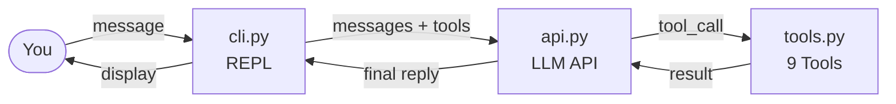

<p align="center">
  
</p>

<p align="center">
  <strong>Your tiny coding claw</strong><br>
  <em>Learn to build an AI coding agent in ~1500 lines of Python</em>
</p>

<p align="center">
  <a href="https://pypi.org/project/miniclaw/"></a>
  <a href="https://pypi.org/project/miniclaw/"></a>
  <a href="LICENSE"></a>
</p>

---

## What is miniclaw?

Ever wondered how tools like [Claude Code](https://docs.anthropic.com/en/docs/agents-and-tools/claude-code/overview) or [OpenClaw](https://github.com/openclaw/openclaw) actually work under the hood? **miniclaw** is the answer -- a minimal, hackable AI coding agent you can read through in an afternoon.

The name says it all: **mini** + **claw** (from Open**Claw**). No sprawling architecture, no thousand-file monorepo. Just the essential loop that powers every AI coding assistant:

```
You type a request
  -> LLM thinks
    -> LLM calls tools (read / write / edit / grep / glob / bash)
      -> Tools execute in your workspace
        -> LLM sees the result
          -> Repeat until done
```

If you want to **learn**, **teach**, or **hack on** an AI agent, start here.

## Features

- **9 Tools** -- `read`, `write`, `edit`, `glob`, `grep`, `bash`, `Skill`, `memory`, `session_search`. Workspace file ops plus on-demand skills, persistent memory, and past-session recall.
- **Plan Mode** -- The agent can enter a read-only planning phase: explore code, produce a structured plan, then execute only after you approve. Write operations are blocked until you say go.
- **Skills System** -- Drop a `SKILL.md` into `.miniclaw/skills/<name>/` and the agent learns new tricks. Skills are injected into the system prompt automatically; the `Skill` tool loads full instructions on demand.
- **Memory** -- Durable facts live in `~/.miniclaw/memory/MEMORY.md` and are auto-injected each session. The agent can read/write topic files for longer notes.
- **Session Search** -- Conversations are recorded locally; the agent can browse, full-text search, or scroll through past sessions.
- **Context Management** -- Micro-compaction and auto-summarize keep long conversations within the context window.
- **Any OpenAI-compatible LLM** -- Swap models by changing one environment variable. Default: MiniMax-M2.7.
- **Workspace Isolation** -- All file operations are sandboxed to your workspace directory. No `..` path escapes.

## Quick Start

**Install:**

```bash
pip install miniclaw
```

**Run:**

```bash
export LLM_API_KEY=your_api_key
cd ~/my-project
miniclaw
```

That's it. You're talking to an AI agent that can read, write, and run code in your project.

<details>
<summary>Other install methods</summary>

**pipx (recommended for isolation):**

```bash
pip install pipx
pipx ensurepath
pipx install miniclaw
```

**From source (for hacking):**

```bash
git clone https://github.com/sundl123/miniclaw.git
cd miniclaw
pip install -e .
```

</details>

> **Tip:** If you get `command not found: miniclaw` after installing, your Python scripts directory isn't in PATH. Run `pipx ensurepath` (pipx) or add `~/.local/bin` to your PATH (pip).

## How It Works

The entire agent fits in a handful of Python modules. Here's the core loop:



Each module has a single responsibility -- read through them in this order:

| Module | What it does |
|--------|-------------|
| [`cli.py`](miniclaw/cli.py) | Command-line REPL, parses input, handles `/plan`, `/clear`, etc. |
| [`api.py`](miniclaw/api.py) | Sends messages to the LLM, runs the tool-call loop until the model stops calling tools |
| [`tools.py`](miniclaw/tools.py) | Implements workspace tools + dispatches `Skill`, `memory`, `session_search` |
| [`context/`](miniclaw/context/) | Micro-compaction, auto-summarize, context window management |
| [`memory/`](miniclaw/memory/) | Persistent memory store and `memory` tool |
| [`sessions/`](miniclaw/sessions/) | Session DB, event records, and `session_search` tool |
| [`plan_mode.py`](miniclaw/plan_mode.py) | Permission guard for plan mode: allows read-only ops, blocks writes |
| [`skills.py`](miniclaw/skills.py) | Scans `.miniclaw/skills/` and injects skill metadata into the system prompt |
| [`settings.py`](miniclaw/settings.py) | Loads and merges config from global + workspace JSON files |
| [`dirs.py`](miniclaw/dirs.py) | Resolves user-level (`~/.miniclaw/`) and workspace-level paths |
| [`config.py`](miniclaw/config.py) | Path safety checks and API constants |
| [`ui.py`](miniclaw/ui.py) | Terminal UI: startup banner, colored output (powered by rich) |
| [`dev_logging.py`](miniclaw/dev_logging.py) | Developer logging to `~/.miniclaw/logs/` |

## Commands

| Command | Description |
|---------|-------------|
| `/plan` | Enter plan mode (read-only exploration) |
| `/plan <description>` | Enter plan mode with a task description |
| `/clear` | Clear conversation history |
| `/model` | Show current model |
| `/quit` `/exit` `/q` | Exit |

**Keyboard shortcuts:** `Ctrl+J` newline, `Up/Down` history, `Ctrl+C` cancel, `Ctrl+D` exit.

## Configuration

Config is JSON, with two layers: global (`~/.miniclaw/config.json`) and workspace (`{workspace}/.miniclaw/config.json`). Workspace config wins.

Run `miniclaw init` to create the default config. Use `miniclaw init --force` to reset.

```json
{
  "llm": {
    "api_key": "your_api_key",
    "model": "MiniMax-M2.7",
    "base_url": "https://api.minimaxi.com/v1",
    "timeout": 300
  },
  "plan_mode": {
    "allowed_bash_patterns": ["^curl\\s+-s"]
  },
  "memory": {
    "enabled": true
  },
  "sessions": {
    "enabled": true
  }
}
```

All `llm` fields can be overridden by environment variables (env vars take priority):

| Variable | Description |
|----------|-------------|
| `LLM_API_KEY` | LLM API key |
| `LLM_MODEL` | Model name (default: `MiniMax-M2.7`) |
| `LLM_BASE_URL` | OpenAI-compatible API base URL |
| `LLM_HTTP_TIMEOUT` | HTTP timeout in seconds (default: 300) |
| `MINICLAW_WORKSPACE` | Workspace directory (also `-w` flag; CLI flag wins) |

## Skills

Create `.miniclaw/skills/<skill-name>/SKILL.md` with YAML frontmatter (`name`, `description`) and instructions in the body. The agent sees the skill list at startup and reads the full SKILL.md on demand.

## File Layout

```
~/.miniclaw/                    # User-level (shared across workspaces)
├── logs/                       # Runtime logs
├── memory/                     # Persistent memory (MEMORY.md + topic files)
├── sessions/                   # Session DB (SQLite + FTS)
└── config.json                 # Global config (optional)

{workspace}/.miniclaw/          # Workspace-level (per project)
├── config.json                 # Workspace config (higher priority)
├── plans/                      # Plan files
└── skills/                     # Skills directory
```

## Project Structure

```
miniclaw/
├── chat.py              # Dev entry point (same as `miniclaw` command)
├── pyproject.toml       # Package config
├── CHANGELOG.md         # Release history
├── miniclaw/            # The Python package
│   ├── cli.py           # REPL
│   ├── api.py           # LLM API + tool loop
│   ├── tools.py         # Tool dispatch
│   ├── context/         # Context compaction + summarization
│   ├── memory/          # Persistent memory tool
│   ├── sessions/        # Session records + search
│   ├── plan_mode.py     # Plan mode permissions
│   ├── config.py        # Path safety + constants
│   ├── dirs.py          # Directory resolution
│   ├── settings.py      # Config loading + merge
│   ├── skills.py        # Skill scanning
│   ├── ui.py            # Terminal UI (rich)
│   └── dev_logging.py   # Dev logging
├── tests/               # Unit tests
└── docs/design/         # Design docs
    └── miniclaw-architecture-analysis.md
```

## Changelog

See [CHANGELOG.md](CHANGELOG.md) for release history.

## Design Documents

| Document | Description |
|----------|-------------|
| [架构分析](docs/design/miniclaw-architecture-analysis.md) | 从 Agent Loop、Skill 机制、Tool 设计、Prompt Cache、Plan Mode 五个维度深入分析项目架构 |

## Running Tests

```bash
python3 -m pytest tests/ -v
```

## Contributing

miniclaw is meant to stay small and readable. PRs that keep things simple are welcome.

## License

[MIT](LICENSE)
