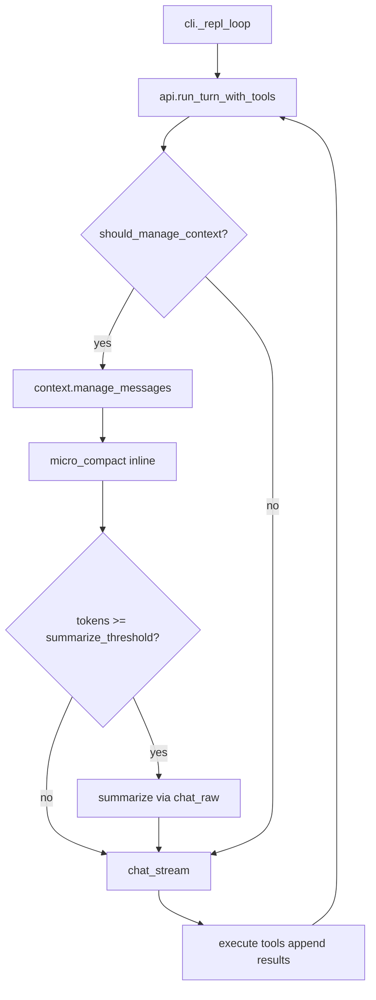

# miniclaw Context Compaction 技术方案

## 背景与约束

当前 miniclaw 将完整 `messages` 列表在每次 [`run_turn_with_tools`](miniclaw/api.py) 循环中原样发给 LLM，tool result 与 `reasoning_details` 会无限累积，无 token 预算与压缩逻辑。

你已确认的设计选择：

| 决策 | 选择 |
|------|------|
| Micro-compaction | **纯内存 inline**：旧内容替换为简短占位，不落盘 |
| Summarization 触发 | **自动 + 手动**（`/compact`） |
| LLM API | OpenAI Chat Completions（MiniMax），**无** Anthropic `cache_edits |

因此 micro-compaction 对齐 [Manus 的 compact 思路](https://rlancemartin.github.io/2025/10/15/manus/)（stale → 占位，recent → full），而非 Claude Code 的 API 级 microcompact；summarization 对齐 [Claude Code Full Compaction](claude-code/docs/context-management.md) 的「摘要替换历史」模式。

---

## 目标架构



**单一入口**：`context.manage_messages(messages, session_ctx)` 在每次 `chat_stream` 之前调用，保证 REPL 多轮与单轮内多 tool round 行为一致。

---

## 新增模块

### [`miniclaw/context.py`](miniclaw/context.py)（核心，~300–400 LOC）

| 子模块 | 职责 |
|--------|------|
| `tokens.py` | `estimate_messages_tokens(messages)` + `update_usage_from_response(usage)` |
| `micro_compact.py` | `micro_compact(messages, config) -> messages`（原地或返回新 list） |
| `summarize.py` | `summarize_conversation(client, model, messages, instructions?) -> messages` |
| `manage.py` | `manage_messages(...)` 编排 micro → summarize 决策 |

### 配置扩展

在 [`default_config.json`](miniclaw/default_config.json) 与 [`settings.py`](miniclaw/settings.py) 增加 `context` 段，支持 env 覆盖（便于测试）：

```json
{
  "context": {
    "enabled": true,
    "context_window_tokens": 200000,
    "reserve_output_tokens": 8000,
    "micro_compact": {
      "enabled": true,
      "keep_recent_tool_results": 3,
      "keep_recent_turns": 2,
      "compact_reasoning_after_turns": 1,
      "placeholder_max_chars": 400
    },
    "auto_summarize": {
      "enabled": true,
      "threshold_buffer_tokens": 12000,
      "min_messages_before_summarize": 10
    },
    "summarize": {
      "keep_recent_messages": 6,
      "max_summary_output_tokens": 4096
    }
  }
}
```

环境变量建议：`MINICLAW_CONTEXT_WINDOW`、`DISABLE_CONTEXT_COMPACT=1`、`DISABLE_AUTO_SUMMARIZE=1`。

---

## 一、Token 计数

**策略**（参考 Claude Code，适配 OpenAI usage 字段）：

```
estimated_tokens =
  last_usage.prompt_tokens          # 若本轮尚未有新 usage
  OR rough_estimate(all messages)   # 冷启动 / usage 缺失时
```

本地估算（[`context/tokens.py`](miniclaw/context.py)）：

- 文本：`len(content) / 4`（JSON 工具参数用 `/2`）
- `tool_calls`：`len(json.dumps(arguments)) / 4`
- `reasoning_details`：拼接 text 后 `/4`
- system prompt 单独计入，**永不压缩**

在 [`chat_stream`](miniclaw/api.py) 返回 usage 后，将 `prompt_tokens` 写入 `session_ctx["last_prompt_tokens"]`（由 `run_turn_with_tools` 维护的 `context` dict 扩展字段，与 plan mode 的 `context` 共用但命名空间分离，例如 `context["_ctx_mgmt"]`）。

---

## 二、Micro-compaction（纯内存）

### 两个 Token 来源（不要混为一谈）

OpenAI 格式里，一次 tool 调用在 context 里占**两处** token：

```
assistant 消息
  └─ tool_calls[].function
       ├─ name          ← 工具名
       └─ arguments     ← JSON 字符串，即 input params（write 的 content 在这里）

tool 消息
  └─ content           ← tool result（read 的文件正文在这里）
```

**默认策略：按工具分别处理 input 与 output，而不是一律只压 result。**

### 按工具的压缩策略

| 工具 | 主要 token 来源 | 压 `arguments`（input） | 压 `content`（result） | stale 后保留的元数据 |
|------|----------------|------------------------|----------------------|---------------------|
| `read` | result 大 | 否（path/offset/limit 很小） | **是** | `path`, `offset`, `limit`, `original_size` |
| `write` | **arguments.content** 大 | **是**（删掉 content，保留 path） | 通常否（`Successfully wrote...` 很短） | `path`, `content_chars`, hint: 内容已在磁盘 |
| `edit` | **arguments** 大（old/new_string） | **是**（截断 string，保留 path） | 通常否 | `path`, `old/new` 各保留前 80 字符 + `...` |
| `glob` | result 可能大 | 否 | 超阈值则压 | `pattern`, 匹配文件数 |
| `grep` | result 大 | 否 | **是** | `pattern`, `path` |
| `bash` | result 大 | 保留 `command`（便于复现） | **是** | `command`, `exit_code`（若有）, `original_size` |

实现上在 `micro_compact.py` 维护 `TOOL_COMPACT_POLICY: dict[str, CompactPolicy]`，每条 policy 声明 `compact_input_fields`, `compact_output`, `preserve_fields`。

**压 input 的方式**（仅改 `assistant.tool_calls[].function.arguments`）：

```python
# write 示例：stale 后
{"path": "src/foo.py", "_compacted": true, "_content_chars": 48200}
# 不再保留 content 全文

# edit 示例：stale 后
{"path": "a.py", "old_string": "def foo():\n  ...", "new_string": "def bar():\n  ...",
 "_compacted": true, "_truncated": true}
```

**压 output 的方式**（改 `tool.content`，与下节占位符相同）。

豁免：单条 message 估算 token `< placeholder_max_chars`（默认约 400 字符）的不压。

### 其他压缩对象

| 类型 | 条件 | 动作 |
|------|------|------|
| `role: assistant` 的 `reasoning_details` | 超出 `compact_reasoning_after_turns` | 删除或替换为 `"[reasoning compacted]"` |
| `role: system` | 永远 | 不碰 |
| 最近 `keep_recent_tool_results` / `keep_recent_turns` | 在窗口内 | input + output **均不压** |

**API round 定义**：从一条 `user` 或带 `tool_calls` 的 `assistant` 开始，到下一次进入 `chat_stream` 之前的一组消息。实现上按索引从后往前数 assistant 消息（含 tool_calls）划定边界。

### 占位符格式（inline，用于 tool result）

```
[compacted tool result]
tool: read
args: {"path": "src/foo.py"}
original_size: ~12400 chars (~3100 tokens)
hint: Content removed from context. Re-invoke read if you need exact text.
```

占位符里的 `args` 来自**压缩前**保存的 arguments 快照（用于恢复调用语义）；write/edit 的 input 压缩则在 **assistant 消息的 arguments** 里就地瘦身，二者互补。

### 不变量（必须单测覆盖）

1. `assistant.tool_calls[i].id` 与 `tool.tool_call_id` **成对保留**；可改 `tool.content` 和/或 `tool_calls[].function.arguments`（按 policy）
2. 不删除消息条目，避免 OpenAI API 校验失败
3. 已 compact 的条目打标（arguments 内 `_compacted` 或 message 元数据），避免重复压缩丢失快照
4. write/edit 压 input 后，hint 明确「文件已写入磁盘，用 read 查看」

### 触发时机

- **每次** `chat_stream` 前执行（轻量 O(n) 扫描）
- 仅当 `estimate_tokens > micro_compact_threshold` 时实际替换（阈值 = `effective_window - auto_summarize.threshold_buffer - 额外 buffer`），避免短对话无意义改动

---

## 三、Summarization（全量摘要）

### 触发时机（与 micro 区分）

| 操作 | 时机 | 单轮 tool 循环内（`run_turn_with_tools` 的 while） |
|------|------|-----------------------------------------------------|
| **micro-compaction** | 时机 A：每次 `chat_stream` 前 | **允许** — 只压 stale，不打断推理 |
| **auto-summarize** | 时机 A：**检查**阈值 | **不执行** — 避免 summarize 替换掉本轮仍需要的上下文 |
| **auto-summarize** | **turn 结束**：`run_turn_with_tools` return 前 | **执行** — 若超阈值且 `pending_summarize` |
| **手动 `/compact`** | 随时 | **允许** — 用户显式意图 |

流程：

```
manage_messages (每次 chat_stream 前)
  → 必做 micro_compact（若超 micro 阈值）
  → 若超 summarize 阈值：仅设 ctx["_ctx_mgmt"]["pending_summarize"] = True

manage_messages_end_of_turn (run_turn_with_tools return 前)
  → 若 pending_summarize 且非 compacting：执行 summarize，清 pending
```

这样「判断」在时机 A，「自动执行」推迟到单轮 tool 循环结束之后，与「不在循环中间轻易 auto-trigger」一致。手动 `/compact` 不受此限制。

### 触发条件（满足任一）

1. **自动**：turn 结束时 `pending_summarize` 为 True（由时机 A 的检查设置），且 `len(messages) >= min_messages_before_summarize`
2. **手动**：用户输入 `/compact` 或 `/compact <extra instructions>`

自动触发前若已连续 micro-compact 两轮仍超阈值，则进入 summarize（避免无效微压缩循环）。

### 摘要调用

- 使用现有 [`chat_raw`](miniclaw/api.py)，**不传 tools**
- `extra_body` 不传 `reasoning_split`（摘要不需要 thinking）
- Prompt 结构（精简版，6 段即可，后续可扩展为 9 段）：

```
system: You summarize agent conversations for continuation.
user:
  <conversation>...</conversation>   # 待压缩区间（可 strip 已 compact 占位）
  Output <analysis> (discarded) and <summary> with sections:
  1. User intent  2. Key files/code  3. Errors/fixes
  4. Completed work  5. Pending tasks  6. Next step (quote recent user msg)
```

解析 `<summary>` 块；解析失败则 fallback：保留最近 N 条消息 + 打印警告，不崩溃。

### 压缩后 messages 重建

```
[
  {role: system, content: <unchanged>},
  {role: user, content: "<compact_boundary>\nSummary:\n...", is_compact_summary: true},
  ...keep_recent_messages  # 最近 K 条原文（含末轮 tool 结果）
]
```

- `keep_recent_messages` 默认 6，保证用户刚说的和当前任务上下文完整
- **不**依赖 transcript 文件（inline 方案暂无全文落盘）；v2 可再加 `.miniclaw/transcripts/` 引用

### 防递归

`manage_messages` 内设置 `context["_ctx_mgmt"]["compacting"] = True` 时跳过 auto-summarize；`run_turn_with_tools` 在 summarize 调用期间不进入 tool 循环。

---

## 四、集成改动

### [`miniclaw/api.py`](miniclaw/api.py)

```python
def run_turn_with_tools(..., context_mgmt: ContextMgmtState | None = None):
    while True:
        messages = manage_messages(client, model, messages, ctx=context_mgmt)
        message, usage = chat_stream(...)
        update_usage(ctx, usage)
        ...
```

- `manage_messages` 在 while 循环顶部调用（micro + 设 pending）
- `manage_messages_end_of_turn` 在 `run_turn_with_tools` return 前调用（执行 auto-summarize）

### [`miniclaw/cli.py`](miniclaw/cli.py)

| 命令 | 行为 |
|------|------|
| `/compact [instructions]` | 调 `summarize_conversation`，打印 status |
| `/context` | 打印 estimated tokens、阈值、已 compact 条数 |
| `/clear` | 同时重置 `context["_ctx_mgmt"]` |

`_init_session` 加载 `get_context_config(workspace)` 并入 session。

---

## 五、阈值计算（参考 Claude Code，按 OpenAI 字段微调）

```
effective_window = context_window_tokens - reserve_output_tokens
auto_summarize_threshold = effective_window - auto_summarize.threshold_buffer_tokens
micro_compact_threshold  = auto_summarize_threshold - 8000   # 提前微压缩
warning_threshold        = effective_window - 20000          # /context 显示 ⚠️
```

熔断：连续 summarize 失败 3 次 → 禁用 auto-summarize，仅保留 micro-compact + 手动 `/compact`。

---

## 六、测试计划

| 文件 | 覆盖 |
|------|------|
| `tests/test_context_tokens.py` | 估算、usage 回退 |
| `tests/test_micro_compact.py` | 保留最近 N 条、占位格式、tool 配对、reasoning 剥离、**per-tool input/output 策略**（write 压 args、read 压 result） |
| `tests/test_summarize.py` | mock `chat_raw` 解析 summary、重建 messages、失败 fallback |
| `tests/test_api.py` | `run_turn_with_tools` 在 mock 下验证 manage 被调用 |

全部使用 mock client，**无**真实 API。

---

## 七、分阶段交付

### Phase 1（MVP，建议首 PR）

- `context.py`：tokens + micro_compact + manage（仅 micro）
- `api.py` 挂钩 + usage 回写
- config + `/context`
- 单元测试

### Phase 2

- summarize + auto trigger + `/compact`
- CLI 提示接近阈值
- 熔断器

### Phase 3（可选，未选但可预留接口）

- 落盘 offload（`.miniclaw/context/tool_results/`）+ 占位符内文件路径
- Session resume / transcript 引用
- 更便宜的 summarize 模型配置项 `context.summarize.model`

---

## 八、风险与缓解

| 风险 | 缓解 |
|------|------|
| Inline 压缩后模型无法看到旧代码 | 占位符明确提示 re-read；保留最近 3 个 tool result |
| Summarize 调用本身超长 | 先对最老 50% messages 做 micro-compact，再发摘要；仍失败则丢弃最老 round（最多 3 次重试） |
| MiniMax `reasoning_details` 回传增大上下文 | micro-compact 优先剥离旧 reasoning |
| 与 plan mode 大段 instruction 冲突 | plan 注入的 user 消息不参与 compact，或计入 `keep_recent_turns` |

---

## 关键参考

- 现有循环入口：[`miniclaw/api.py:289-327`](miniclaw/api.py)
- Claude Code 阈值与摘要结构：[context-management.md](claude-code/docs/context-management.md)
- Manus stale/full 策略：[Context Engineering in Manus](https://rlancemartin.github.io/2025/10/15/manus/)
