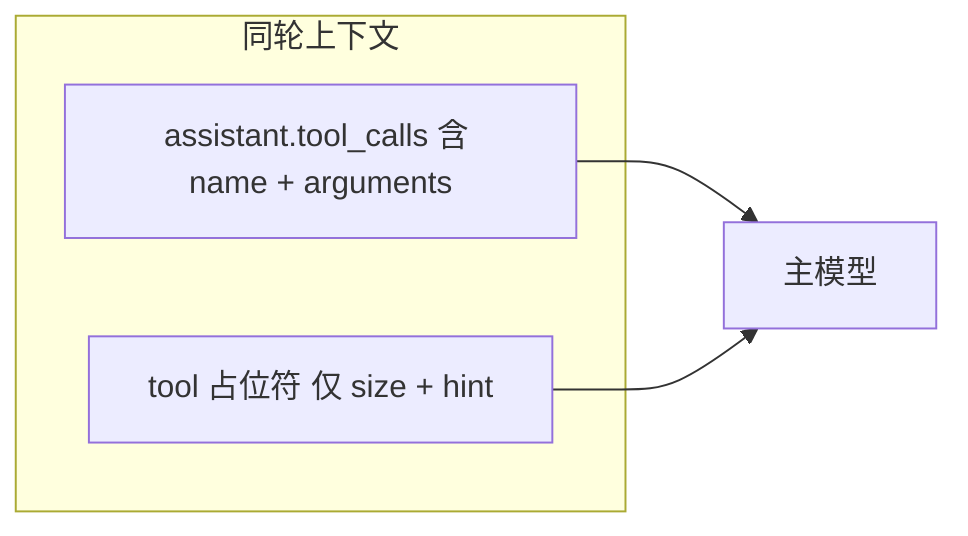

# 极简 Tool 占位符（Slim Placeholder）

## 目标格式（你已确认）

统一一行，**不再**输出 `tool:` / `args:` / `original_size:` 多行块：

```text
[compacted] bash ~39 tokens — re-invoke bash if needed
```

- 数字用 **token 估算**（沿用现有 `estimate_text_tokens`），与当前 `~N tokens` 语义一致。
- **hint 统一**：所有工具同一模板 `re-invoke {tool_name} if needed`（你已选择 uniform，write/edit 不单独写「use read」）。

## 为何安全



- 主对话里 **assistant 消息仍在**，`arguments` 仍是 command/path 的权威来源。
- 占位符只说明「哪类工具、结果多大、可重调」，不重复 JSON。
- Summarize 路径仍保留 [`_messages_to_text`](miniclaw/context/summarize.py) 里的 `[assistant tool_call] name: args[:500]`，档案信息不丢。

## 代码改动

### 1. [`miniclaw/context/micro_compact.py`](miniclaw/context/micro_compact.py)

重写 `_format_result_placeholder`：

```python
def _format_result_placeholder(tool_name: str, original_content: str) -> str:
    est = estimate_text_tokens(original_content)
    return f"[compacted] {tool_name} ~{est} tokens — re-invoke {tool_name} if needed"
```

- 删除 `args` 参数及 `json.dumps(args)`。
- 调用处（compact tool result 分支）只传 `tool_name` + `original_content`。
- **不改** `write`/`edit` 的 **arguments 压缩**逻辑（`_compact_arguments` 仍压 assistant 侧 `content` / 截断 `old_string`）。

### 2. 测试 [`tests/test_micro_compact.py`](tests/test_micro_compact.py)

更新 `test_read_compacts_stale_result_only`：

- 断言 `content` 以 `[compacted]` 开头（或包含）。
- 断言含 `read`、`tokens`、`re-invoke read`。
- 断言 **不含** `args:`、不含完整 `json.dumps({"path": ...})`。

可选加一条 `test_placeholder_one_line`：压缩后 `content` 不含换行（或仅单行），防止回退多行格式。

### 3. 不改动

- **无新 config 项**（默认即 slim，避免配置膨胀）。
- **不改** [`summarize.py`](miniclaw/context/summarize.py) 的 `_messages_to_text`（仍靠 `[assistant tool_call]` 提供 args）。
- **不改** placeholder 触发条件（`placeholder_max_chars`、protected indices 照旧）。

## 预期效果

| 场景 | 之前（约） | 之后（约） |
|------|------------|------------|
| bash find 占位符 | ~150+ 字符（含整段 command JSON） | ~50 字符 |
| 10 条旧 tool 结果 | 重复 10 次 command | 仅 10 行短提示 |
| summarize 输入 | tool 行 + tool_call 行重复 args | tool 行变短，tool_call 行仍保留 |

## 验证

```bash
cd /Users/sundongliang/Projects/miniclaw
/usr/bin/python3 -m unittest tests.test_micro_compact tests.test_summarize -v
/usr/bin/python3 -m unittest discover -s tests -q
```
