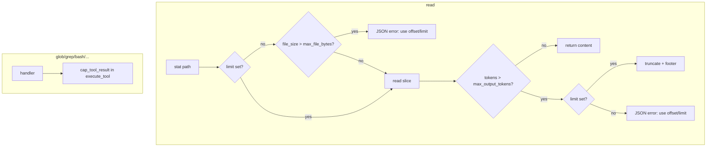

# Tool 输出上限与 read 分页改造

## 目标

- **read**：参考 claude-code，避免无 `limit` 整文件读爆上下文；策略为你选择的 **throw_then_truncate**。
- **glob / grep / bash**（及未来 plan 工具）：在统一出口做**可配置长度截断**，附简短 footer，避免巨型 tool result 进入对话。
- **配置**：写入 [`miniclaw/default_config.json`](miniclaw/default_config.json)，经 [`miniclaw/settings.py`](miniclaw/settings.py) 加载，与现有 `context` 配置模式一致。

## 行为规格



| 场景 | 行为 |
|------|------|
| `read` 无 `limit`，文件 > `max_file_bytes` | **错误 JSON**（~100 字节），提示 `offset`/`limit` |
| `read` 无 `limit`，读完后 token > `max_output_tokens` | **错误 JSON**（同上） |
| `read` 有 `limit`，读完后 token > `max_output_tokens` | **截断** + footer（说明原长度、建议继续 offset） |
| `glob` 匹配数 > `max_glob_files` | 只返回前 N 条路径 + 「… and M more」 |
| `grep` / `bash` / plan 工具返回值 | 经 `execute_tool` **字符上限截断**（默认 ~100KB 量级） |
| `write` / `edit` 成功短消息 | 同样走统一 cap（实际不会触发） |

**保持 0-based `offset`**（与现有测试、schema 一致），在错误/ footer 文案中写清楚。

## 配置结构（建议默认值）

在 `default_config.json` 新增顶层 `tools`：

```json
"tools": {
  "read": {
    "max_file_bytes": 262144,
    "max_output_tokens": 8000
  },
  "max_tool_result_chars": 100000,
  "max_glob_files": 500
}
```

- `max_file_bytes`：对齐 claude-code 256KB（仅 **无 limit** 时检查**整文件**大小）。
- `max_output_tokens`：用现有 [`estimate_text_tokens`](miniclaw/context/tokens.py) 估算，不引入 API countTokens。
- `max_tool_result_chars`：全局截断（grep/bash/plan 等）；约 25k token 量级 @ 4 chars/token。
- 可选 env：`MINICLAW_READ_MAX_FILE_BYTES`、`MINICLAW_TOOL_MAX_RESULT_CHARS`（在 `get_tools_config` 中覆盖）。

## 实现步骤

### 1. 配置层

- 新建 [`miniclaw/tools_config.py`](miniclaw/tools_config.py)：`ReadToolConfig`、`ToolsConfig` dataclass。
- 在 [`miniclaw/settings.py`](miniclaw/settings.py) 增加 `get_tools_config(workspace_root) -> ToolsConfig`。
- 更新 [`miniclaw/default_config.json`](miniclaw/default_config.json)。

### 2. 共享工具函数

新建 [`miniclaw/tool_output.py`](miniclaw/tool_output.py)（或并入 `tools_config.py` 旁的小模块）：

- `format_file_size(n: int) -> str`
- `cap_tool_result(text: str, max_chars: int, *, tool_name: str) -> str` — 保留尾部 footer，不破坏 JSON error 前缀检测（对已是 `{"error":` 的短结果可跳过 cap）。
- `truncate_read_output(content: str, max_tokens: int) -> str` — 按字符安全截断到约 `max_tokens * 4` 并附 footer。

### 3. 重构 `read`（[`miniclaw/tools.py`](miniclaw/tools.py)）

新建 [`miniclaw/read_file.py`](miniclaw/read_file.py)（轻量，不必照搬 claude 10MB 流式）：

- `os.stat` 预检；**无 `limit`** 且 `st_size > max_file_bytes` → 抛/返回结构化错误。
- 读取：**避免无条件 `readlines()` 全文件**；有 `limit` 或文件较小时按行迭代截取 `[offset, offset+limit)`；极大文件 + 有 `limit` 时用逐行扫描（不加载全文）。
- 行号格式保持 `f"{i+1:6d}|{line}"`（与现有一致）。
- 边界：`offset` 越界 → 与 claude 类似的短提示（空文件 / offset 超出 `total_lines`）。
- `handle_read` 签名增加 `tools_cfg: ToolsConfig | None = None`（默认从 `get_tools_config` 取），读完做 token 判断并按上表 throw/truncate。

更新 `get_tool_schemas()` 中 read 的 description：强调大文件必须 `limit`，无 limit 时文件不得超过 `max_file_bytes`。

### 4. 其它 handler 微调

| 工具 | 改动 |
|------|------|
| **glob** | `files[:max_glob_files]`，超出时 append `\n… and {n} more files (truncated)` |
| **grep** | 保持 `grep -rn`；依赖全局 `cap_tool_result`；可选在 subprocess 后先按行数软限（非必须，v1 可只做 char cap） |
| **bash** | 仅全局 char cap |
| **plan_mode** | `execute_tool` 出口统一 cap，无需改 handler |

### 5. 统一出口 [`execute_tool`](miniclaw/tools.py)

```python
cfg = tools_config or get_tools_config(root)
...
result = handler(args, root, tools_cfg=cfg)  # read/glob 需要
result = cap_tool_result(result, cfg.max_tool_result_chars, tool_name=name)
```

- JSON error 且 `len(result) < 512` 时可跳过二次截断（避免截断错误信息）。
- `api.py` 的 `_execute_tool_call` 无需改签名（仍调 `execute_tool`）。

### 6. 测试

扩展 [`tests/test_tools.py`](tests/test_tools.py)：

- read：超 `max_file_bytes` 无 limit → error；有 limit 小文件 → 成功；超大输出 + limit → 含 `[truncated]` footer；offset/limit 行为回归。
- glob：生成 >N 文件 → 只返回 N 条 + more 提示。
- bash：伪造长 stdout（echo 重复）→ 结果被 cap。
- `execute_tool` 集成：cap 对 plan/bash 生效。

全量 `python3 -m unittest discover -s tests -q`。

## 不在本次范围

- read 的 10MB 流式路径、重复读 dedup、mtime stub（claude 高级特性）。
- grep 改用 ripgrep 或 `-m` 匹配上限（可后续加 `max_grep_matches`）。
- 修改 micro-compact / summarize 逻辑（仍依赖更短的 tool result，间接受益）。

## 风险与说明

- **无 limit + 文件 < 256KB 但 token 极高**（极长行）：按你的选择返回 **error**，迫使模型分页；与「有 limit 则截断」一致。
- **glob 截断**是「条数」而非字符；路径极长时仍可能偏大，由全局 `max_tool_result_chars` 兜底。
