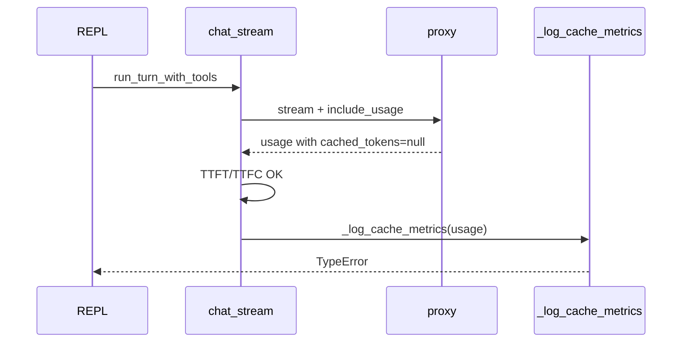

# 修复 miniclaw `_log_cache_metrics` TypeError

## 问题回顾

[`miniclaw/api.py`](file:///Users/sundongliang/Projects/miniclaw/miniclaw/api.py) 中流式请求结束后会调用 `_log_cache_metrics(result.usage)`。当上游（如 laozhang 代理）返回：

- `prompt_tokens_details` **存在**
- `cached_tokens` **字段存在但值为 `null`**

时，`getattr(details, "cached_tokens", 0)` 返回 `None`（默认值仅在属性缺失时生效），导致 `None / prompt_tokens` 抛出 `TypeError`。



影响路径：`chat_stream`（L236）与 `chat_raw`（L265）两处调用，修复函数本体即可覆盖。

[`record_usage`](file:///Users/sundongliang/Projects/miniclaw/miniclaw/context/tokens.py) / `update_usage_from_response` 只读 `prompt_tokens` 且已有 `is not None` 判断，**无需改动**。

## 修复方案（最小 diff）

### 1. 修改 [`miniclaw/api.py`](file:///Users/sundongliang/Projects/miniclaw/miniclaw/api.py) 中 `_log_cache_metrics`

当前代码（L48–52）：

```python
prompt_tokens = getattr(usage, "prompt_tokens", 0) or 0
...
cached = getattr(details, "cached_tokens", 0) if details else 0
ratio = (cached / prompt_tokens * 100) if prompt_tokens > 0 else 0.0
```

**改动**：对 `cached` 增加与 `prompt_tokens` 相同的 `or 0` 归一：

```python
cached = (getattr(details, "cached_tokens", 0) if details else 0) or 0
```

语义：缺失、`None`、其他 falsy 数值均视为 0，缓存命中率记为 0%。

**可选增强（非必须）**：若希望与文件中已有的 [`_get_field`](file:///Users/sundongliang/Projects/miniclaw/miniclaw/api.py)（L64–68，支持 dict/SDK 对象）一致，可改为：

```python
details = _get_field(usage, "prompt_tokens_details")
cached = _get_field(details, "cached_tokens", 0) or 0
```

本次建议采用 **`or 0` 一行修复**即可解决你现场的问题；若后续发现代理把 `prompt_tokens_details` 打成 dict，再考虑 `_get_field`。

不修改架构文档（[`docs/design/miniclaw-architecture-analysis.md`](file:///Users/sundongliang/Projects/miniclaw/docs/design/miniclaw-architecture-analysis.md)）除非你想同步示例代码。

### 2. 补单元测试 [`tests/test_api.py`](file:///Users/sundongliang/Projects/miniclaw/tests/test_api.py)

新增 `TestLogCacheMetrics`（或并入现有 API 测试类）：

| 用例 | 构造 | 断言 |
|------|------|------|
| `cached_tokens` 显式为 `None` | `usage.prompt_tokens=100`，`details.cached_tokens=None` | 调用不抛异常；可用 `patch` 捕获 `get_dev_logger().info`，断言日志含 `cached_tokens=0`、`cache_hit_ratio=0.00%` |
| （已有 mock 行为）`prompt_tokens_details=None` | 保持现有 stream mock | 回归：仍走 `cached=0` 分支 |

从 `miniclaw.api` import `_log_cache_metrics`，直接测辅助函数，无需 mock 网络。

现有 [`test_api.py`](file:///Users/sundongliang/Projects/miniclaw/tests/test_api.py) 中三处 `usage_obj.prompt_tokens_details = None` 可保留；新用例专门覆盖「details 存在、cached 为 None」的代理形态。

### 3. 验证

在项目根执行：

```bash
cd /Users/sundongliang/Projects/miniclaw && python -m pytest tests/test_api.py -k cache -v
# 或全量 API 测试
python -m pytest tests/test_api.py -v
```

手动复现（可选）：在 mas-multi-modal 工作区再次问「你会做什么」，确认 dev log 出现 `Cache metrics:` 行且 REPL 不崩溃。

## 范围与不做的事

- **只做**：`_log_cache_metrics` 空值处理 + 1 条测试
- **不做**：改代理、改模型、改 `record_usage`、重构 usage 解析层
- **不提交**：除非你明确要求 git commit

## 预期结果

代理返回 `cached_tokens: null` 时，日志类似：

`Cache metrics: prompt_tokens=1234, cached_tokens=0, cache_hit_ratio=0.00%, completion_tokens=56`

对话正常结束，不再在流式完成后因日志代码崩溃。
