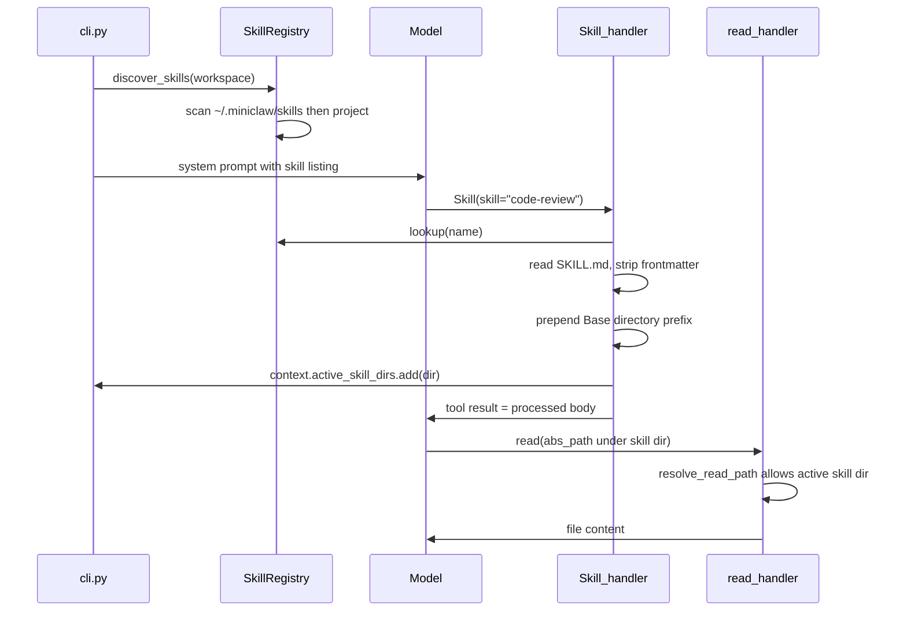

# miniclaw Skill Tool Phase 1 方案

## 设计原则

- **极简**：不做 `$ARGUMENTS`、`${MINICLAW_SKILL_DIR}`、`` !`cmd` `` 等模板预处理
- **对齐 Claude Code 命名**：tool 名 `Skill`，输入仅 `{ "skill": "name" }`（Phase 1 无 `args`）
- **Base directory 是唯一路径锚点**：加载时在正文前注入绝对路径，模型用该路径访问 reference 文件
- **安全边界**：只有**已调用 Skill tool 加载过**的 skill 目录，才允许 `read` 超出 workspace

## 架构



## Skill 目录与优先级

| 层级 | 路径 | 优先级 |
|------|------|--------|
| 全局 | `~/.miniclaw/skills/<name>/SKILL.md` | 低 |
| 项目 | `{workspace}/.miniclaw/skills/<name>/SKILL.md` | 高（覆盖同名） |

扫描顺序：先 global，再 project；同名 project entry 覆盖 global entry。

## 核心数据结构

在 [`miniclaw/skills.py`](miniclaw/skills.py) 新增：

```python
@dataclass
class SkillEntry:
    name: str
    description: str
    skill_dir: str      # 绝对路径，skill 根目录
    skill_md_path: str  # SKILL.md 绝对路径
    source: str         # "global" | "project"

class SkillRegistry:
    def lookup(name: str) -> SkillEntry | None
    def list_metadata() -> list[dict]   # for system prompt
    def load_skill_body(name: str) -> str  # strip frontmatter + base dir prefix
```

`load_skill_body` 输出格式：

```text
Base directory for this skill: /abs/path/to/skill-dir

(SKILL.md body, frontmatter stripped)
```

`skill` 参数兼容 `/commit` 写法：自动 strip  leading `/`。

## 路径解析改造

当前 [`miniclaw/config.py`](miniclaw/config.py) 的 `resolve_path` 对所有路径做 `lstrip("/")`，**无法正确处理绝对路径**。需新增专用函数：

```python
def resolve_read_path(
    path: str,
    workspace_root: str,
    *,
    allowed_skill_dirs: set[str] | frozenset[str] = frozenset(),
) -> str:
    """workspace 内相对/绝对路径 + 已加载 skill 目录下的绝对路径"""
```

规则：
1. **绝对路径**：normalize 后，若落在 `workspace_root` 下 → 允许；若落在 `allowed_skill_dirs` 任一目录下 → 允许；否则 `PermissionError`
2. **相对路径**：沿用现有 `resolve_path` 逻辑（仅 workspace 内）

`write` / `edit` **不**扩展放行范围（reference 文件只读）。

`bash` 无需改路径解析：命令在 workspace cwd 执行，模型用绝对路径调用 skill 脚本即可（如 `bash /Users/.../skills/foo/run.sh`）。

## Tool 集成

### [`miniclaw/tools.py`](miniclaw/tools.py)

- 新增 `handle_skill(args, workspace_root, context)`：
  - 从 `context["skill_registry"]` 取 registry
  - `lookup(skill)` 失败 → JSON error
  - 成功 → `context.setdefault("active_skill_dirs", set()).add(entry.skill_dir)`
  - 返回 `registry.load_skill_body(name)`
- 注册 `TOOL_HANDLERS["Skill"]`
- `get_tool_schemas()` 追加 schema（参考 Claude Code，仅 `skill` 必填）
- `handle_read` 改为调用 `resolve_read_path(..., allowed_skill_dirs=context.get("active_skill_dirs", set()))`

### [`miniclaw/cli.py`](miniclaw/cli.py)

`_init_session` 改造：

```python
registry = discover_skills(workspace)
system_prompt = build_system_prompt(registry.list_metadata(), workspace_root=workspace)
context 初始化时携带 skill_registry（通过 session dict 或在 _repl_loop 的 context 中设置）
```

`_repl_loop` 的 `context` dict 增加：
- `skill_registry: SkillRegistry`
- `active_skill_dirs: set[str]`（初始为空；`/clear` 时清空）

### [`miniclaw/skills.py`](miniclaw/skills.py) system prompt 改写

替换现有「请用 read 读 SKILL.md」指引为：

- 任务匹配 skill 时，**必须先调用 `Skill` tool**
- 加载后按正文指令执行；reference 文件位于 `Base directory` 下，用**绝对路径**调用 `read` 或 `bash`
- 列表展示 `- name: description`（可选标注 `[global]` / `[project]`）

## 会话生命周期

| 事件 | 行为 |
|------|------|
| 启动 | `discover_skills` → registry 固定到 session |
| `/clear` | 清空 `active_skill_dirs`（skill 列表不变） |
| 每次 Skill 调用 | 追加该 skill_dir 到 `active_skill_dirs` |
| Plan Mode | `Skill` tool 始终允许（只读加载 prompt） |

## 测试计划

[`tests/test_skills.py`](tests/test_skills.py) 扩展：
- `discover_skills` 双目录扫描
- project 覆盖 global 同名 skill
- `load_skill_body` frontmatter 剥离 + Base directory 前缀
- `/name` strip

[`tests/test_tools.py`](tests/test_tools.py) 新增：
- `resolve_read_path`：workspace 内、skill dir 绝对路径、未加载 skill dir 拒绝、路径逃逸拒绝
- `handle_skill` → 激活 dir → `read` 可读 global skill reference
- 未 load 时 read global skill 文件被拒绝

## 文档更新

更新 [`AGENTS.md`](miniclaw/AGENTS.md) 中 Skill 相关描述（全局目录、Skill tool、read 放行规则）。

## Phase 1 明确不做

- `$ARGUMENTS` / `${MINICLAW_SKILL_DIR}` / `` !`cmd` `` 模板引擎
- `args` 参数
- `allowed-tools` frontmatter 联动
- skill listing 预算截断
- compaction 后 `invoked_skills` 保活
- 用户 `/skill-name` REPL slash command
- fork 子 agent 模式
- 父目录向上遍历（monorepo 多 `.miniclaw/skills`）

## 关键文件改动一览

| 文件 | 改动 |
|------|------|
| [`miniclaw/skills.py`](miniclaw/skills.py) | SkillRegistry、discover_skills、load_skill_body、system prompt |
| [`miniclaw/config.py`](miniclaw/config.py) | 新增 resolve_read_path |
| [`miniclaw/tools.py`](miniclaw/tools.py) | handle_skill、Skill schema、read 路径改造 |
| [`miniclaw/cli.py`](miniclaw/cli.py) | 初始化 registry、context 字段、/clear 重置 |
| [`miniclaw/__init__.py`](miniclaw/miniclaw/__init__.py) | 导出新 API（如需要） |
| [`tests/test_skills.py`](tests/test_skills.py) | registry 测试 |
| [`tests/test_tools.py`](tests/test_tools.py) | 路径 + Skill tool 集成测试 |
