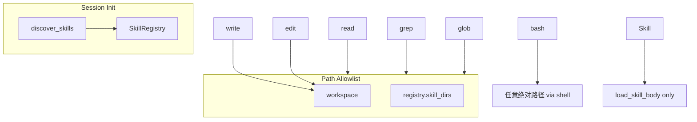

# Skill 系统简化计划

## 目标

在 Phase 1 已实现 `Skill` tool 的基础上，按讨论结论做三项简化，并统一 read/grep/glob 的 skill 目录访问规则。

| 变更 | 现在 | 改后 |
|------|------|------|
| system prompt | 含 `~/.miniclaw/skills/` 路径、`[global]`/`[project]` 标签 | 仅规则 + `name: description` 列表（对齐 Claude Code） |
| skill 目录 read 放行 | 仅 `active_skill_dirs`（load 后） | registry 内**全部**已注册 `skill_dir`（启动即生效） |
| grep/glob | 仅 workspace | 显式指向 skill 目录时同样放行 |
| bash | 无路径限制 | **不变**（已支持绝对路径脚本） |
| write/edit | 仅 workspace | **不变** |

## 架构（简化后）



`Skill` tool 不再维护任何目录激活状态，只负责加载 SKILL.md 正文。

---

## 1. 精简 system prompt

文件：[`miniclaw/skills.py`](miniclaw/skills.py) — `build_system_prompt()`

**删除：**
- `全局技能目录：~/.miniclaw/skills/`
- `项目技能目录：{workspace}/.miniclaw/skills/（同名时覆盖全局技能）`
- 列表中的 `[global]` / `[project]` 后缀
- 空列表提示里的具体路径

**保留/调整为（参考 Claude Code skill_listing）：**
```
## 技能（Skills）
当任务与某个 skill 的描述匹配时，必须先调用 Skill 工具加载，再按正文执行。
不要跳过 Skill 工具直接回答。
Skill 加载后会给出 Base directory；reference 文件用绝对路径 read/bash/grep/glob。

## 当前可用技能列表
- code-review: 结构化 code review
- deploy: 部署流程
```

`list_metadata()` 可继续内部携带 `source` 字段（供未来 dev CLI 用），但 `build_system_prompt` 不再展示。

---

## 2. Registry 提供 skill 目录集合

文件：[`miniclaw/skills.py`](miniclaw/skills.py) — `SkillRegistry`

新增方法：

```python
def skill_dirs(self) -> frozenset[str]:
    return frozenset(e.skill_dir for e in self._entries.values())
```

---

## 3. 统一路径解析（config.py）

文件：[`miniclaw/config.py`](miniclaw/config.py)

将 `resolve_read_path(..., allowed_skill_dirs=...)` 参数重命名为 `registered_skill_dirs`（语义更准确），逻辑不变：

- 绝对路径：在 `workspace_root` 或任一 `registered_skill_dirs` 下 → 允许
- 相对路径：走现有 `resolve_path`（仅 workspace）

新增 `resolve_glob_pattern()` 供 glob 使用：

```python
def resolve_glob_pattern(
    pattern: str,
    workspace_root: str,
    *,
    registered_skill_dirs: frozenset[str] = frozenset(),
) -> tuple[str, str]:
    """返回 (full_glob_pattern, result_base)。

    - 相对 pattern：join workspace，result_base=workspace（返回相对路径）
    - 绝对 pattern：提取首个 glob 元字符前的静态前缀，用 resolve_read_path 校验；
      result_base=该前缀目录（返回绝对路径）
    """
```

静态前缀提取：对 pattern 在第一个 `*`, `?`, `[` 处截断，取 `os.path.dirname` 作为待校验目录（若为空则用 `/` 或 pattern 本身）。

---

## 4. 工具层改造

文件：[`miniclaw/tools.py`](miniclaw/tools.py)

### 公共 helper

```python
def _registered_skill_dirs(context: dict | None) -> frozenset[str]:
    registry = (context or {}).get("skill_registry")
    return registry.skill_dirs() if registry else frozenset()
```

### read

- 从 `context["active_skill_dirs"]` 改为 `registry.skill_dirs()`
- 删除对 `active_skill_dirs` 的依赖

### grep

- 签名增加 `context: dict | None = None`
- `search_path` 改用 `resolve_read_path(..., registered_skill_dirs=...)`
- 支持 `path="/Users/.../.miniclaw/skills/foo"` 或相对 workspace 路径

### glob

- 签名增加 `context: dict | None = None`
- 调用 `resolve_glob_pattern()` 得到 `(full_pattern, result_base)`
- 匹配结果：
  - `result_base == workspace_root` → 返回相对 workspace 的路径（保持现有行为）
  - 否则（skill 目录）→ 返回**绝对路径**（因不在 workspace 内）
- 结果过滤：每个命中文件必须在 workspace 或某一 `registered_skill_dirs` 下（防 symlink 逃逸）

### handle_skill

- **删除** `active_skill_dirs.add(...)` 两行，仅返回 `load_skill_body`

### execute_tool

- `read` / `grep` / `glob` 均传入 `context=ctx`

---

## 5. 移除会话状态

文件：[`miniclaw/cli.py`](miniclaw/cli.py)

- 删除 `context["active_skill_dirs"]` 初始化
- 删除 `/clear` 时对 `active_skill_dirs` 的重置

---

## 6. 测试更新

### [`tests/test_skills.py`](tests/test_skills.py)

- `build_system_prompt` 断言：不含 `~/.miniclaw`、`[global]`、`[global]`
- 新增 `SkillRegistry.skill_dirs()` 测试

### [`tests/test_tools.py`](tests/test_tools.py)

- `resolve_read_path`：rename 参数；**未注册** skill 目录仍拒绝；**已注册**目录无需先 load 即可 read
- 删除/改写 `test_inactive_skill_dir_rejected`、`handle_skill` 激活 dir 相关断言
- 新增 `grep` 在 registered skill dir 下搜索
- 新增 `glob` 绝对 pattern 在 skill dir 下匹配
- `handle_skill` 不再断言 `active_skill_dirs`

---

## 7. 文档

更新 [`AGENTS.md`](miniclaw/AGENTS.md)：

- Skill 描述改为：registry 内 skill 目录对 read/grep/glob 只读放行（非「已加载」）
- 删除 `active_skill_dirs` 相关表述

---

## 不变项

- project 覆盖 global 的扫描合并逻辑
- `Skill` tool 与 Base directory 注入
- write/edit 仍限 workspace
- bash 不增加路径校验（绝对路径脚本已可用）

## 涉及文件

| 文件 | 改动 |
|------|------|
| [`miniclaw/skills.py`](miniclaw/skills.py) | 精简 prompt、`skill_dirs()` |
| [`miniclaw/config.py`](miniclaw/config.py) | 重命名参数、`resolve_glob_pattern()` |
| [`miniclaw/tools.py`](miniclaw/tools.py) | read/grep/glob/skill 简化 |
| [`miniclaw/cli.py`](miniclaw/cli.py) | 删除 active_skill_dirs |
| [`tests/test_skills.py`](tests/test_skills.py) | prompt + registry 测试 |
| [`tests/test_tools.py`](tests/test_tools.py) | 路径/grep/glob 集成测试 |
| [`AGENTS.md`](miniclaw/AGENTS.md) | 机制说明 |
