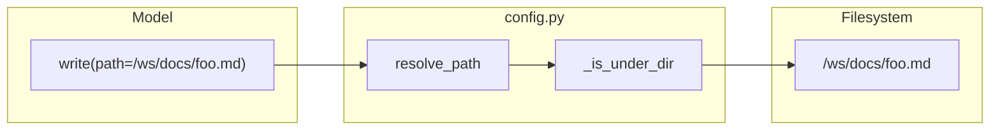
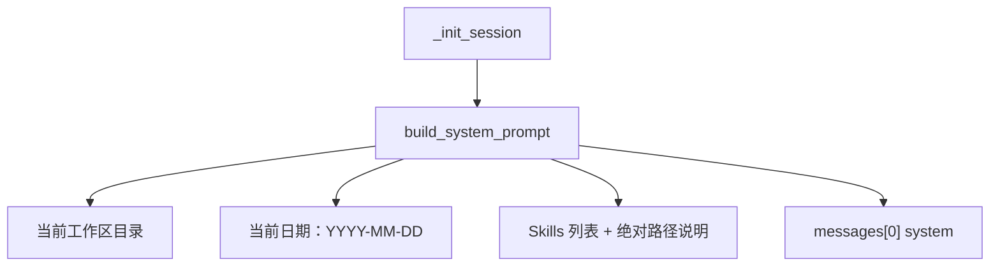

# 路径修复 + System Prompt 日期注入

## 背景与目标

日志中暴露的两类问题：

1. **路径 bug**：模型传入 workspace 绝对路径时，`resolve_path()` 执行 `path.lstrip("/")` 再 `join(workspace, path)`，导致写入错误嵌套路径却返回 `Successfully wrote to {原始 path}`。
2. **日期缺失**：system prompt 无当前日期，skill 要求报告文件名带日期时模型会臆造（如 `2025-07-15`）。

用户要求：**简单方案**——日期只加在 system prompt；路径对齐 Claude Code（绝对路径 + 正确解析）。

---

## 1. 修复路径解析（核心）

**文件**：[`miniclaw/config.py`](miniclaw/config.py)

重写 `resolve_path()`，对齐 Claude Code `expandPath` 语义（workspace 内）：

```python
def resolve_path(path: str, workspace_root: str) -> str:
    workspace_root = os.path.normpath(workspace_root)
    if os.path.isabs(path):
        abs_path = os.path.normpath(path)
    else:
        abs_path = os.path.normpath(os.path.join(workspace_root, path))
    if not _is_under_dir(abs_path, workspace_root):
        raise PermissionError(f"路径不允许超出工作区: {path}")
    return abs_path
```

要点：

- **删除** `path.lstrip("/")`（bug 根因）
- 绝对路径：normalize 后直接校验是否在 workspace 下
- 相对路径：保留现有行为（兼容现有测试与习惯用法）

`resolve_read_path()` 中相对路径分支仍调用 `resolve_path()`，无需额外改动；read/grep/glob 的绝对路径逻辑已正确。

**连带修复**（同一函数，自动生效）：

- [`miniclaw/tools.py`](miniclaw/tools.py) — `handle_write` / `handle_edit`
- [`miniclaw/plan_mode.py`](miniclaw/plan_mode.py) — `_is_plan_dir_write()`（日志中 plan 文件绝对路径被拒的问题）

**UX 小改进**（同文件 `tools.py`）：

- `handle_write` / `handle_edit` 成功消息改为返回**实际写入路径** `abs_path`，避免再次误导：

```python
return f"Successfully wrote to {abs_path}"
```

---

## 2. Tool schema 与 Prompt 统一为绝对路径

**文件**：[`miniclaw/tools.py`](miniclaw/tools.py) — `get_tool_schemas()`

更新 `path` 字段 description（保持参数名 `path`，不改为 `file_path`，减少破坏性）：

| 工具 | 新 description（英文，与现有 schema 风格一致） |
|------|-----------------------------------------------|
| read | `The absolute path to the file to read (must be absolute, not relative)` |
| write | `The absolute path to the file to write (must be absolute, not relative)` |
| edit | `The absolute path to the file to modify (must be absolute, not relative)` |
| grep | `Absolute path to search in (default: workspace root as absolute path)` — 可选：handler 默认把 `.` 解析为 `workspace_root` 绝对路径，与 schema 一致 |

glob 的 `pattern` 描述已支持 skill 绝对路径，可补充一句 workspace 文件也应用绝对 pattern（如 `/path/to/ws/**/*.py`），非必须。

**文件**：[`miniclaw/skills.py`](miniclaw/skills.py) — `build_system_prompt()`

调整 Skills 段落，避免只强调 read：

```text
文件工具（read/write/edit/grep/glob）的 path 必须使用绝对路径。
workspace 内文件以「当前工作区目录」为前缀；skill reference 以 Skill 加载后的 Base directory 为前缀。
```

---

## 3. System Prompt 注入日期（简单版）

**文件**：[`miniclaw/config.py`](miniclaw/config.py) 或 [`miniclaw/skills.py`](miniclaw/skills.py)

新增小函数（建议放 `config.py`，与路径工具并列）：

```python
def get_local_iso_date() -> str:
    override = os.environ.get("MINICLAW_OVERRIDE_DATE")
    if override:
        return override
    # 本地时区 ISO 日期 YYYY-MM-DD
    ...
```

**文件**：[`miniclaw/skills.py`](miniclaw/skills.py) — `build_system_prompt()`

在 `当前工作区目录` 下一行追加：

```text
当前日期：2026-06-03
```

（运行时调用 `get_local_iso_date()`）

设计说明（刻意保持简单，不做 Claude Code 的 `userContext` meta message / `date_change` attachment）：

- 日期在 [`miniclaw/cli.py`](miniclaw/cli.py) `_init_session()` 时写入 system message，**会话内固定**（与 Claude Code `getSessionStartDate` memoize 思路类似）
- 不实现跨午夜更新（用户要求简单；长会话跨日场景可后续再加）
- 测试/debug 可用 `MINICLAW_OVERRIDE_DATE=2026-06-03`（对标 Claude Code 的 `CLAUDE_CODE_OVERRIDE_DATE`）

---

## 4. 测试

**文件**：[`tests/test_tools.py`](tests/test_tools.py)

| 新增/扩展 | 内容 |
|-----------|------|
| `TestResolvePath.test_absolute_workspace_path` | 绝对路径解析到 workspace 内正确位置 |
| `TestResolvePath.test_absolute_outside_workspace_rejected` | `/etc/passwd` 等被拒绝 |
| `TestHandleWrite.test_write_absolute_path` | 绝对 path 写入后文件在预期位置 |
| `TestHandleEdit.test_edit_absolute_path` | 同上 |
| `TestIsPlanDirWrite.test_write_to_plan_dir_absolute` | 绝对 plan 路径在 Plan Mode 下允许 |
| `TestCheckPlanMode.test_plan_mode_allows_plan_dir_write_absolute` | 集成测试 |

**文件**：[`tests/test_skills.py`](tests/test_skills.py)

- `test_with_workspace_root` 扩展：断言含 `当前日期：` 且格式为 `\d{4}-\d{2}-\d{2}`
- 可选：用 `MINICLAW_OVERRIDE_DATE` 测 override

运行：`python -m pytest tests/` 或项目现有 test 命令，确保 106+ tests 全过。

---

## 5. 文档

**文件**：[`AGENTS.md`](AGENTS.md)

- 工具 path 约定改为「绝对路径」
- 补充 system prompt 含当前日期、`MINICLAW_OVERRIDE_DATE` 说明

[`docs/design/plan-mode.md`](docs/design/plan-mode.md) 中 `resolve_path` 描述可顺带更新一句「支持 workspace 内绝对路径」（可选，非阻塞）。

---

## 数据流（修复后）





---

## 不在本次范围

- 参数重命名 `path` → `file_path`（可后续对齐 Claude Code API）
- 跨午夜 `date_change` attachment
- `userContext` meta message 机制
- Skill 模板 `{{review_time}}` 自动替换

---

## 改动文件清单

| 文件 | 改动 |
|------|------|
| [`miniclaw/config.py`](miniclaw/config.py) | 修复 `resolve_path`；新增 `get_local_iso_date` |
| [`miniclaw/tools.py`](miniclaw/tools.py) | schema 描述；write/edit 成功消息 |
| [`miniclaw/skills.py`](miniclaw/skills.py) | system prompt 日期 + 绝对路径说明 |
| [`tests/test_tools.py`](tests/test_tools.py) | 路径/plan mode/write 回归测试 |
| [`tests/test_skills.py`](tests/test_skills.py) | 日期注入断言 |
| [`AGENTS.md`](AGENTS.md) | 文档同步 |

[`miniclaw/plan_mode.py`](miniclaw/plan_mode.py) 无需改代码，随 `resolve_path` 修复自动生效。
