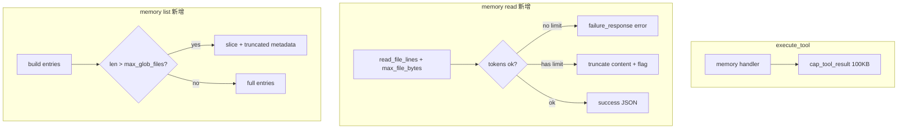

# Memory Tool 防爆三项落地

## 背景与目标

memory tool 已走 [`execute_tool`](miniclaw/tools.py) 全局 `cap_tool_result`（100KB），但缺少 workspace `read` 的**语义化**防护；topic 文件磁盘不限大小，`read`/`list` 和 write 的 tool_call args 仍可能撑爆上下文。

本次只做调研结论中的 **P0 + P1（1/2/3）**，不做 JSON 感知截断（P2）。



---

## 1. memory read 对齐 ToolsConfig.read（P0）

### 1.1 抽取共享逻辑

在 [`miniclaw/tool_output.py`](miniclaw/tool_output.py) 新增小函数，避免 `handle_read` 与 `store.read_file` 双份维护：

```python
@dataclass(frozen=True)
class ReadOutputLimitResult:
    content: str
    error: str | None = None
    truncated: bool = False

def enforce_read_output_limits(
    content: str,
    *,
    limit: int | None,
    max_output_tokens: int,
) -> ReadOutputLimitResult:
    """与 handle_read 相同：无 limit 超 token → error；有 limit → truncate_read_output。"""
```

行为与 [`handle_read`](miniclaw/tools.py) L90–104 完全一致（throw-then-truncate）。

### 1.2 重构 handle_read

[`miniclaw/tools.py`](miniclaw/tools.py) `handle_read` 在 `read_file_lines` 之后改为调用 `enforce_read_output_limits`；对外行为不变，[`tests/test_tools.py`](tests/test_tools.py) read 相关用例作为回归。

### 1.3 扩展 MemoryStore.read_file

[`miniclaw/memory/store.py`](miniclaw/memory/store.py) `read_file` 签名增加 `read_cfg: ReadToolConfig | None = None`：

| 步骤 | 改动 |
|------|------|
| 调用 `read_file_lines` | 传入 `max_file_bytes=read_cfg.max_file_bytes if limit is None else None` |
| `FileTooLargeError` | `return self._failure_response(str(e))`（短 JSON，不触发 cap 问题） |
| token 校验 | `enforce_read_output_limits(...)` |
| error | `_failure_response(result.error)` |
| truncated | `resp["content_truncated"] = True`（合法 JSON 内标记，优于全局盲截） |
| 缺省 | `read_cfg is None` 时用 `ReadToolConfig()` 默认值（与 workspace read 一致） |

**不**为 MEMORY.md 单独设更严上限——磁盘已有 25KB 预算；复用 `tools.read` 即可。

### 1.4 透传 tools_cfg

[`miniclaw/tools.py`](miniclaw/tools.py) `execute_tool`：

```python
elif name == "memory":
    result = handler(args, context=ctx, tools_cfg=cfg)
```

[`miniclaw/memory/tool.py`](miniclaw/memory/tool.py) `handle_memory` 增加 `tools_cfg: ToolsConfig | None = None`，read 时：

```python
result = store.read_file(path, offset=..., limit=..., read_cfg=(tools_cfg or get_tools_config(...)).read)
```

`get_tools_config` 需要 `workspace_root`：由 `execute_tool` 传入 `tools_cfg=cfg` 即可，handler 内**不**再调 `get_tools_config`（`handle_memory` 签名加 `workspace_root` 可选，或仅依赖 `tools_cfg`——推荐后者，`execute_tool` 保证总有 `cfg`）。

### 1.5 Schema / 文案

[`get_memory_tool_schema`](miniclaw/memory/tool.py) 更新：

- 顶层 `MEMORY_TOOL_DESCRIPTION`：topic 文件虽磁盘不限，**read 大文件必须用 offset/limit**
- `offset` / `limit` 的 description 对齐 workspace read（无 limit 时 >256KB 拒绝）

---

## 2. memory list 条数上限（P1）

复用 [`ToolsConfig.max_glob_files`](miniclaw/tools_config.py)（默认 500），**不新增配置项**。

### 2.1 MemoryStore.list_files

签名增加 `max_entries: int = 500`：

```python
total = len(entries)
if total > max_entries:
    resp["entries"] = entries[:max_entries]
    resp["entries_truncated"] = True
    resp["total_entries"] = total
else:
    resp["entries"] = entries
```

`message` 可改为 `Listed {shown} of {total} entries`（截断时）。

### 2.2 透传

`handle_memory` list 分支：

```python
result = store.list_files(path or "", recursive=recursive, max_entries=cfg.max_glob_files)
```

### 2.3 Schema

`recursive` 描述补充：结果最多返回 `max_glob_files` 条，超出见 `entries_truncated` / `total_entries`。

---

## 3. micro-compact memory 策略（P1）

[`miniclaw/context/micro_compact.py`](miniclaw/context/micro_compact.py) `TOOL_COMPACT_POLICY` 增加：

```python
"memory": CompactPolicy(
    compact_input_fields=frozenset({"content"}),
    compact_output=True,
    truncate_input_fields=frozenset({"old_string", "new_string"}),
    truncate_chars=80,
),
```

与 workspace `write` / `edit` 对齐：

- **write**：旧 turn 的 `content` 从 tool_call args 移除，留 `_content_chars`
- **edit**：`old_string` / `new_string` 截到 80 字符
- **read**：旧 turn 的 tool result 压成 `[compacted] memory ~N tokens` 占位符

### 3.1 _compact_arguments 小扩展

在现有 `write` hint 分支旁增加：

```python
if tool_name == "memory" and out.get("action") == "write" and "path" in out:
    out.setdefault("_hint", "content on disk; use memory read to view")
```

---

## 测试计划

| 文件 | 新增用例 |
|------|----------|
| [`tests/test_memory_store.py`](tests/test_memory_store.py) 或新建 `test_memory_read_limits.py` | read 无 limit 超大 topic 文件 → `success: false`；有 limit + 超大输出 → `content_truncated: true`；MEMORY.md 正常 read |
| [`tests/test_memory_tool.py`](tests/test_memory_tool.py) | `execute_tool("memory", read ...)` 集成；list 生成 >N 文件 → `entries_truncated` |
| [`tests/test_micro_compact.py`](tests/test_micro_compact.py) | `memory` write 大 `content` args 被 compact；memory read 旧 result 被 compact |
| [`tests/test_tools.py`](tests/test_tools.py) | 可选：为 `enforce_read_output_limits` 加 1–2 个单元测试（若从 handle_read 抽离） |

测试模式沿用现有：`tempfile` + `patch get_memory_dir` + 小 `ToolsConfig`/`ReadToolConfig`。

---

## 文档

[`docs/design/agent-memory.md`](docs/design/agent-memory.md) Phase 1 表格补一行：

- read/list 受 `tools.read` / `tools.max_glob_files` 约束（topic 磁盘不限，tool 输出限）

无需改 [`default_config.json`](miniclaw/default_config.json)。

---

## 改动文件清单

| 文件 | 变更 |
|------|------|
| [`miniclaw/tool_output.py`](miniclaw/tool_output.py) | `ReadOutputLimitResult` + `enforce_read_output_limits` |
| [`miniclaw/tools.py`](miniclaw/tools.py) | `handle_read`  refactor；`execute_tool` 传 `tools_cfg` 给 memory |
| [`miniclaw/memory/store.py`](miniclaw/memory/store.py) | `read_file` / `list_files` 上限逻辑 |
| [`miniclaw/memory/tool.py`](miniclaw/memory/tool.py) | `handle_memory` 接 `tools_cfg`；schema 文案 |
| [`miniclaw/context/micro_compact.py`](miniclaw/context/micro_compact.py) | `memory` policy + hint |
| tests（见上） | 覆盖三条路径 |
| [`docs/design/agent-memory.md`](docs/design/agent-memory.md) | 一行说明 |

---

## 风险与边界

- **全局 `cap_tool_result` 保留**：仍是最后兜底；语义化 read 限制后，正常路径不应再触发 JSON 被拦腰截断。
- **list 与 glob 共用 500**：语义不同但阈值相同；你已确认接受；日后若要独立再加 `max_memory_list_entries`。
- **edit 读全文进内存**：topic 大文件 edit 时 `store.edit_file` 仍 `f.read()` 全文——本次不在范围；真正爆炸点是 read result 和 write args，已覆盖。
