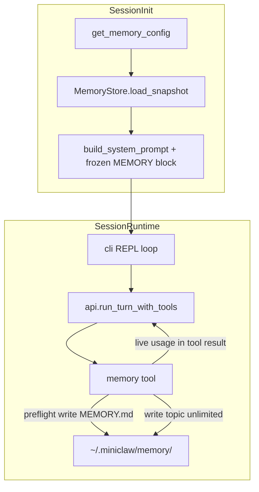

# MiniClaw Memory Phase 1 方案

## 设计结论（已确认）

| 决策 | 选择 |
|------|------|
| 作用域 | 全局唯一：`~/.miniclaw/memory/`（不区分项目） |
| 瓶颈 | **仅 `MEMORY.md`** 限制大小并每 session 注入 system prompt |
| 默认上限 | 25KB + 200 行（config 可 override） |
| topic / 子目录 | **不限制**大小与数量；模型自由组织 |
| MEMORY.md 内容 | 高信号摘要优先；空间不足时再 demote 到 topic + 指针 |
| 写入反馈 | 每次 memory tool 返回 `memory_md_usage`；≥80% 软 warning |
| System prompt | **Frozen snapshot**（session 启动捕获，session 内不变） |
| 启动防御 | 磁盘上 MEMORY.md 超限 → 截断注入 + 明确 truncation 标记 |
| 删除 | **禁止 delete `MEMORY.md`**；topic 可 delete |
| 读取 topic | **仅 memory tool**（不扩展现有 `read` 白名单） |
| Phase 1 不做 | records、/reflect、AGENTS.md |

### 为何 bytes **和** lines 都要限制？

两者互补，只限一种会有漏洞：

- **只限 bytes**：单行可占满 25KB，仍算「1 行」
- **只限 lines**：200 行短句也可能总 bytes 可控但结构噪声大

写入与注入均按 **双阈值取更严**：`used_bytes <= max_bytes AND used_lines <= max_lines`；任一超限即拒绝写入或触发启动截断。

---

## 架构



**Frozen 语义**（对齐 Hermes [`tools/memory_tool.py`](file:///Users/sundongliang/Projects/hermes-agent/tools/memory_tool.py) `_system_prompt_snapshot`）：

- 启动时：`load_snapshot()` 读磁盘 → 按 limits **截断**（若需）→ 存入 `MemoryStore._prompt_snapshot`（字符串，整 session 不变）
- Session 内：`memory` tool 写盘并更新 `MemoryStore._live_state`（供 tool 响应 usage）；**不**修改 `messages[0]` system content
- 下次启动：重新 load，新 snapshot 生效

---

## 目录与文件

```
~/.miniclaw/memory/
├── MEMORY.md              # 唯一受限；启动 frozen 注入
├── preferences.md         # topic 示例（模型自建）
├── projects/miniclaw.md   # 子目录允许
└── ...
```

- 根目录：`get_user_data_dir() / "memory"`（复用 [`miniclaw/dirs.py`](miniclaw/dirs.py)）
- 首次启用：确保目录存在；若 `MEMORY.md` 不存在则创建空文件或最小占位（见下）

**MEMORY.md 占位模板**（可选，便于模型理解）：

```markdown
# Memory

<!-- Loaded every session. Keep highest-signal facts here. Details go in other files under ~/.miniclaw/memory/ -->
```

---

## 配置

在 [`miniclaw/default_config.json`](miniclaw/default_config.json) 增加：

```json
"memory": {
  "enabled": false,
  "memory_md_max_bytes": 25600,
  "memory_md_max_lines": 200,
  "warn_threshold_pct": 80
}
```

在 [`miniclaw/settings.py`](miniclaw/settings.py) 新增 `MemoryConfig` dataclass + `get_memory_config(workspace_root)`，模式对齐 [`get_context_config`](miniclaw/settings.py)。

| 字段 | 默认 | 含义 |
|------|------|------|
| `enabled` | `false` | 总开关；关则无 memory tool、不注入 |
| `memory_md_max_bytes` | 25600 | MEMORY.md UTF-8 字节上限 |
| `memory_md_max_lines` | 200 | MEMORY.md 行数上限（`\n` 分割，含末行无换行） |
| `warn_threshold_pct` | 80 | 软 warning 阈值 |

---

## 核心模块

新增包 `miniclaw/memory/`：

| 文件 | 职责 |
|------|------|
| [`miniclaw/memory/config.py`](miniclaw/memory/config.py) | `MemoryConfig` dataclass |
| [`miniclaw/memory/paths.py`](miniclaw/memory/paths.py) | `get_memory_dir()`, `resolve_memory_path(rel_path)` — 禁止 `..`、禁止绝对路径逃逸 |
| [`miniclaw/memory/budget.py`](miniclaw/memory/budget.py) | `measure_content(bytes, lines)`, `check_budget(content, limits) -> BudgetResult`, `truncate_for_prompt(content, limits) -> (text, TruncationMeta)` |
| [`miniclaw/memory/store.py`](miniclaw/memory/store.py) | `MemoryStore`：snapshot、live usage、atomic write |
| [`miniclaw/memory/tool.py`](miniclaw/memory/tool.py) | `handle_memory`, `MEMORY_SCHEMA`, `get_memory_tool_schema()` |
| [`miniclaw/memory/prompt.py`](miniclaw/memory/prompt.py) | `format_memory_system_block(snapshot, meta)` — 渲染注入块 + usage header |

### MemoryStore 关键 API

```python
class MemoryStore:
    def load_snapshot(self) -> None:
        """读 MEMORY.md → truncate_for_prompt → 存 _prompt_snapshot + _truncation_meta"""

    def format_for_system_prompt(self) -> str | None:
        """返回 frozen block；空文件返回 None"""

    def memory_md_usage(self) -> MemoryMdUsage:
        """基于磁盘 live 文件计算 bytes/lines/pct（tool 响应用）"""

    def preflight_write_memory_md(self, new_content: str) -> PreflightResult:
        """不写盘；超限返回 success=False + hints"""

    def write_file(self, rel_path: str, content: str) -> dict:
        """MEMORY.md: preflight → atomic write；其他: 直接 write"""

    def edit_file(self, rel_path: str, old_string: str, new_string: str) -> dict:
        """读-改-写；MEMORY.md 对结果 full content 再 preflight"""

    def read_file(self, rel_path: str, offset?, limit?) -> dict
    def list_files(self, rel_dir: str = "", recursive: bool = False) -> dict
    def delete_file(self, rel_path: str) -> dict  # 拒绝 MEMORY.md
```

**Atomic write**：temp file + `os.replace`（参考 Hermes `_write_file`），避免半写 corrupt。

---

## Preflight 实现（写 MEMORY.md 前）

逻辑在 [`budget.py`](miniclaw/memory/budget.py) + [`store.py`](miniclaw/memory/store.py)：

```
1. 收到 write/edit 目标路径
2. resolve_memory_path → abs_path
3. 若 rel_path != "MEMORY.md":
     → 直接 atomic write（无 size check）
     → 响应附带 memory_md_usage() + 可选 warning
4. 若 rel_path == "MEMORY.md":
     a. 得到 would_be_content（write 全文 / edit 应用 patch 后全文）
     b. used_bytes = len(would_be_content.encode("utf-8"))
     c. used_lines = would_be_content.count("\n") + (1 if content and not content.endswith("\n") else 0)
        （空 content → 0 行）
     d. 若 used_bytes > max_bytes OR used_lines > max_lines:
          → success=false, 磁盘不变
          → error 说明超了哪条、超出多少
          → hints: 缩短 / demote 到 topic / 删 stale
          → 返回 current live usage
     e. 否则 atomic write
     f. 成功响应 + memory_md_usage + (pct >= warn_threshold ? warning)
```

**edit 的 preflight**：必须先内存中合成 `new_content`，再对合成结果做 (b–d)；不能先写再回滚。

**与启动截断的关系**：

- Preflight = **主动防御**（正常 tool 路径不写出超限文件）
- 启动截断 = **被动防御**（手动改文件、bug、旧版无 preflight 时仍安全注入）

启动截断算法（`truncate_for_prompt`）：

1. 若 bytes 与 lines 均未超限 → 全文注入，`truncated=false`
2. 否则按 **行优先** 截取前 N 行（N = min(max_lines, 能 fit max_bytes 的最大行数）：
   - 从第 1 行累加，直到再加一行会超 `max_bytes` 或达到 `max_lines`
3. 注入块末尾追加：

```
[memory truncated: {total_bytes} bytes / {total_lines} lines on disk;
 showing {shown_bytes} bytes / {shown_lines} lines.
 Use memory(action=read, path=MEMORY.md) for full file.]
```

---

## Memory Tool Schema 设计

**单一 tool `memory`**，`action` 分发（类似 Hermes `memory` tool，但面向文件而非 § entry）。

### Parameters

```json
{
  "name": "memory",
  "description": "... 见下 ...",
  "parameters": {
    "type": "object",
    "properties": {
      "action": {
        "type": "string",
        "enum": ["read", "write", "edit", "list", "delete", "status"]
      },
      "path": {
        "type": "string",
        "description": "Relative path under ~/.miniclaw/memory/ (e.g. MEMORY.md, notes/foo.md). Required for read/write/edit/delete."
      },
      "content": {
        "type": "string",
        "description": "Full file content. Required for write."
      },
      "old_string": { "type": "string", "description": "Required for edit." },
      "new_string": { "type": "string", "description": "Required for edit." },
      "offset": { "type": "integer", "description": "0-based line offset for read." },
      "limit": { "type": "integer", "description": "Max lines for read." },
      "recursive": { "type": "boolean", "description": "For list: include subdirectories." }
    },
    "required": ["action"]
  }
}
```

### Description 要点（写入 schema prose）

- **Only MEMORY.md** is auto-loaded every session (frozen in system prompt); treat it as scarce (~25KB / 200 lines)
- Put highest-signal facts in MEMORY.md; long detail in other files (any subpath, no size limit)
- When MEMORY.md is full: shorten, remove stale items, move detail to topic files, leave summary or link
- **Cannot delete MEMORY.md**; use edit to clear sections conservatively
- Every mutating action returns `memory_md_usage`; warnings appear above 80%
- Do not save ephemeral task state; save durable preferences, corrections, environment facts

### 响应 JSON 统一形状

**成功（写 MEMORY.md）**：

```json
{
  "success": true,
  "action": "write",
  "path": "MEMORY.md",
  "memory_md_usage": {
    "used_bytes": 4200, "limit_bytes": 25600,
    "used_lines": 38, "limit_lines": 200,
    "pct_bytes": 16, "pct_lines": 19,
    "display": "16% — 4.1/25.0 KB, 38/200 lines"
  },
  "warning": null
}
```

**成功（写 topic）**：同上结构，额外 `"topic_bytes": 48200`，`message` 注明 topic 无大小限制。

**失败（MEMORY.md 超限）**：

```json
{
  "success": false,
  "error": "MEMORY.md would exceed limits (28,400 bytes > 25,600; 210 lines > 200). ...",
  "violations": ["bytes", "lines"],
  "would_be": {"bytes": 28400, "lines": 210},
  "limits": {"bytes": 25600, "lines": 200},
  "memory_md_usage": { "... current on disk ..." },
  "hints": ["...", "..."]
}
```

**delete MEMORY.md**：

```json
{"success": false, "error": "Deleting MEMORY.md is not allowed. Use edit to remove sections."}
```

---

## 接入现有代码

### 1. [`miniclaw/cli.py`](miniclaw/cli.py) `_init_session`

- 若 `memory.enabled`：`MemoryStore(config).load_snapshot()`
- `build_system_prompt(..., memory_block=store.format_for_system_prompt())`
- `context["memory_store"] = store`
- `tools = get_tool_schemas(include_memory=True)` 或 memory 启用时 append schema

### 2. [`miniclaw/skills.py`](miniclaw/skills.py) `build_system_prompt`

- 新增可选参数 `memory_block: str | None`
- 非空时追加在 skills 段之后：

```
## Auto Memory
{memory_block}
```

### 3. [`miniclaw/tools.py`](miniclaw/tools.py)

- `TOOL_HANDLERS["memory"] = handle_memory`
- `execute_tool`：memory 分支传入 `context`，从 `context["memory_store"]` 取 store
- `get_tool_schemas()`：`enabled` 时追加 memory schema（或由 cli 传入 flag）
- **不**修改 `read`/`write`/`edit` 白名单（用户选择 memory_tool_only）

### 4. [`miniclaw/cli.py`](miniclaw/cli.py) REPL 命令

- `/memory` 或 `/memory-status`：打印 frozen snapshot 元信息 + live `memory_md_usage` + 目录路径
- `/clear`：**不清** memory snapshot（仅清 messages；system 仍含同一 frozen block）

### 5. 文档

- 更新 [`docs/design/agent-memory.md`](docs/design/agent-memory.md) 反映 Phase 1 定稿（替换原三层/records-first MVP 描述，保留 Phase 2 roadmap）

---

## 测试计划

新增 [`tests/test_memory_budget.py`](tests/test_memory_budget.py)、[`tests/test_memory_store.py`](tests/test_memory_store.py)、[`tests/test_memory_tool.py`](tests/test_memory_tool.py)：

| 用例 | 验证 |
|------|------|
| bytes 未超、lines 超 | preflight 拒绝 |
| 单行超大 | lines=1 但 bytes 超 | 拒绝 |
| topic 超大 write | 成功，无 limit error |
| delete MEMORY.md | 拒绝 |
| delete topic | 成功 |
| preflight 失败 | 磁盘内容不变 |
| load 超限文件 | snapshot 截断 + meta 正确 |
| frozen | write MEMORY 后 `format_for_system_prompt()` 不变 |
| tool 成功 | 含 usage；85% 含 warning |
| path `../etc/passwd` | PermissionError |

使用 temp dir 作为 `~/.miniclaw`（monkeypatch `get_user_data_dir`），无真实 API。

---

## Phase 2（不在本 PR，文档预留）

- `~/.miniclaw/records/*.jsonl`
- `/reflect` 读 records + consolidate/demote MEMORY.md
- 可选：启动 nudge 提醒模型写 memory

---

## 实现顺序建议

1. `budget.py` + `paths.py` + unit tests（纯函数）
2. `store.py` + snapshot/truncate/preflight tests
3. `tool.py` + schema + handler tests
4. `settings` / `default_config.json` / cli+skills+tools 集成
5. 更新 design doc + `/memory-status`
