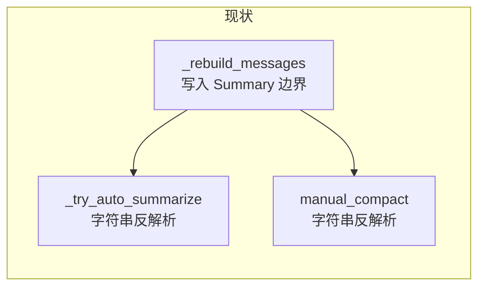
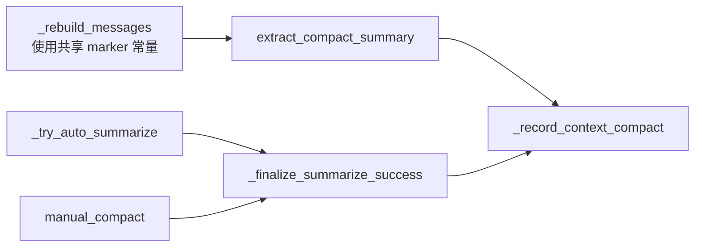

# Context Compact 记录逻辑去重方案

## 问题

[`miniclaw/context/manage.py`](miniclaw/context/manage.py) 里两处 success 分支几乎相同：

- [`_try_auto_summarize`](miniclaw/context/manage.py) L84–100（auto-summarize 成功后）
- [`manual_compact`](miniclaw/context/manage.py) L173–189（`/compact` 成功后）

重复内容：

1. 从 `new_messages` 里找 `is_compact_summary` 消息，用 `"Summary:\n"` / `"\n\nRecent messages"` 字符串切出 summary
2. 调用 `records_writer.append_meta("context_compact", ...)`

更深风险：boundary 格式在 [`summarize.py` `_rebuild_messages`](miniclaw/context/summarize.py) L207–211 定义，解析却在 `manage.py` 硬编码——改文案会静默丢 summary。



---

## 目标结构



---

## 改动 1：[`summarize.py`](miniclaw/context/summarize.py) — 单一事实来源

在 `_rebuild_messages` 上方增加模块级常量（与现有英文 boundary 一致）：

```python
_COMPACT_SUMMARY_MARKER = "Summary:\n"
_COMPACT_TAIL_MARKER = "\n\nRecent messages"
```

- `_rebuild_messages` 用常量拼 `boundary`（行为不变）
- 新增公开函数 `extract_compact_summary(messages, *, max_chars=4000) -> str`：
  - 扫描 `is_compact_summary` 消息
  - 用 marker 切出 body，`strip()` 后截断到 `max_chars`
  - 找不到则返回 `""`

**不放** `manage.py`：解析规则与生成格式同属 summarize 域。

---

## 改动 2：[`manage.py`](miniclaw/context/manage.py) — 两个私有 helper

### `_record_context_compact(context, *, messages_before, new_messages)`

```python
writer = (context or {}).get("records_writer")
if writer is None:
    return
writer.append_meta(
    "context_compact",
    summary=extract_compact_summary(new_messages),
    messages_before=messages_before,
    messages_after=len(new_messages),
)
```

### `_finalize_summarize_success(ctx, on_progress, context, *, messages_before, new_messages)`

合并两处相同的 success 收尾：

- `ctx["consecutive_summarize_failures"] = 0`
- `ctx["last_prompt_tokens"] = None`
- `_notify_progress(on_progress, "done")`
- `_record_context_compact(...)`

---

## 改动 3：调用点替换

| 函数 | 替换前 | 替换后 |
|------|--------|--------|
| `_try_auto_summarize` success | L81–100 共 ~20 行 | `_finalize_summarize_success(ctx, on_progress, context, messages_before=messages_before, new_messages=new_messages)` |
| `manual_compact` success | L170–189 共 ~20 行 | 同上，`messages_before=len(messages)` |

**不合并**的部分（保持原样）：

- auto 路径的前置门槛（token 阈值、失败计数、`auto_summarize_disabled`）
- 两条路径各自的 failure / `compacting` try-finally 结构
- `manual_compact` 的 `extra_instructions`

---

## 测试

在 [`tests/test_summarize.py`](tests/test_summarize.py) 新增 `test_extract_compact_summary`：

- 用 `_rebuild_messages(system, "hello summary", tail=[])` 构造消息
- 断言 `extract_compact_summary(msgs) == "hello summary"`
- 无 `is_compact_summary` 消息时返回 `""`
- `max_chars` 截断生效

可选（轻量）：在 [`tests/test_sessions_records.py`](tests/test_sessions_records.py) 测 `_record_context_compact` 是否写出 `type=context_compact`——若 helper 保持 `_` 私有，可通过 import 模块函数或只测 `extract_compact_summary` 即可；**至少保证 summarize 单测覆盖解析**。

运行：`pytest tests/test_summarize.py tests/test_sessions_records.py -q`

---

## 不在本次范围

- 不改 boundary 文案、不改 records 事件 schema
- 不抽第三层「统一 summarize 调用包装」（auto vs manual 差异足够，收益小）
- 不把 records 逻辑挪到 `sessions/`（`records_writer` 由 REPL context 注入，manage 依赖合理）

---

## 预期收益

- 删除 ~30 行重复代码
- boundary 格式改动只需改 `summarize.py` 一处
- 未来若有第三种压缩入口（如 gateway），只调 `_finalize_summarize_success` 即可
