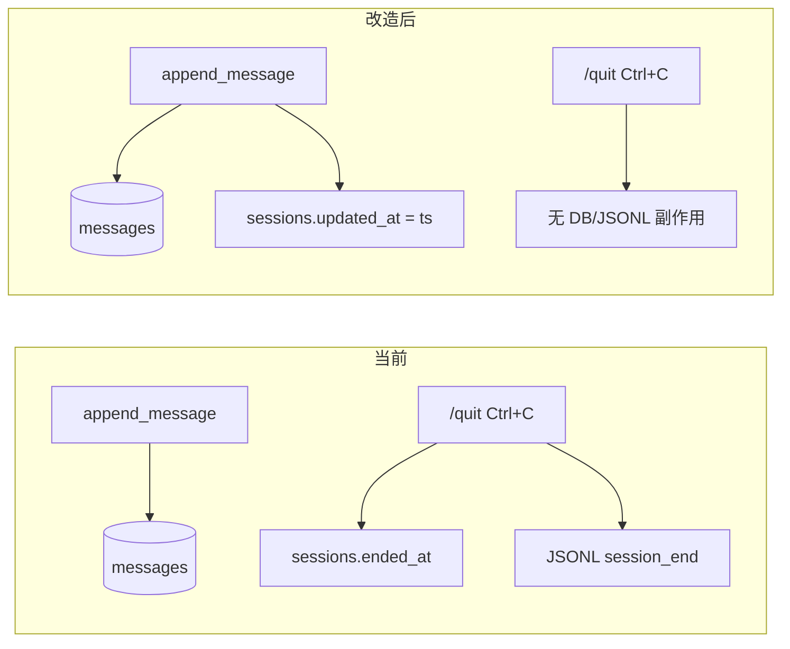

# ended_at → updated_at 改造方案

## 背景与目标

当前 [`ended_at`](miniclaw/sessions/db.py) 仅在 CLI 正常退出时写入，不参与搜索，且与「会话可 resume」矛盾。改为 **`updated_at`（最后活动时间）**，在每次 dual-write 时更新，作为 browse / 未来 resume 的统一时间戳。

用户确认：**退出时不再写 `session_end` JSONL 事件**。

---

## 1. Schema 变更（无 migration）

**文件**: [`miniclaw/sessions/db.py`](miniclaw/sessions/db.py)

session_search 尚未有真实用户数据，**不做 `schema_version` 升级，不写 v1→v2 迁移逻辑**。

- `_SCHEMA_VERSION` 保持 `1` 不变
- 直接修改 `_SCHEMA_SQL` 中 `sessions` 表定义：`ended_at TEXT` → `updated_at TEXT NOT NULL`
- 新增 browse 排序索引：
  `CREATE INDEX IF NOT EXISTS idx_sessions_updated_at ON sessions(updated_at DESC);`

**本地开发注意**：若已有旧版 `~/.miniclaw/state.db`（含 `ended_at` 列），需手动删除后让 miniclaw 重建，或在 README/PR 说明一句即可。不为此写 ALTER/DROP 迁移代码。

---

## 2. DB API 调整

**文件**: [`miniclaw/sessions/db.py`](miniclaw/sessions/db.py)

| 操作 | 变更 |
|------|------|
| 删除 | `mark_session_ended()` |
| 修改 | `insert_session()` — INSERT 时设 `updated_at = started_at` |
| 修改 | `insert_message()` — 同一事务内追加 `UPDATE sessions SET updated_at = ? WHERE id = ?`（用消息的 `ts`） |
| 修改 | `browse_sessions()` — `ORDER BY s.updated_at DESC`（替代 `started_at`）；返回字段 `ended_at` → `updated_at` |

`insert_message` 内联 touch 即可，不必单独抽 `touch_session()`（除非函数过长；当前改动很小）。

---

## 3. RecordsWriter 与 CLI 清理

**文件**: [`miniclaw/sessions/records.py`](miniclaw/sessions/records.py)

- **删除** `mark_session_end()` 方法（含 `append_meta("session_end")` 与 DB 调用）

**文件**: [`miniclaw/cli.py`](miniclaw/cli.py)

- 删除两处 `records_writer.mark_session_end()`（`EOFError/KeyboardInterrupt` 与 `/quit` 分支，约 137–138、145–146 行）
- 退出逻辑仅保留 `print("再见。")` + `break`

`updated_at` 的刷新完全由 `_write_event` → `insert_message` 链路承担，无需在退出时额外操作。

---

## 4. session_search 元数据

**文件**: [`miniclaw/sessions/search.py`](miniclaw/sessions/search.py)

- `session_meta` 中补充 `updated_at`（discovery 与 scroll 两处，约 175–179、256–260 行）
- 不返回 `ended_at`

---

## 5. 测试更新

**文件**: [`tests/test_sessions_records.py`](tests/test_sessions_records.py)

- `test_session_meta_events` 重写：
  - 不再调用 `mark_session_end()`
  - 断言 `append_user` 后 `updated_at` 非空且随最后一条消息的 `ts` 更新
  - 断言 JSONL 中**无** `session_end` type
- 可选新增 `test_updated_at_on_create`：`insert_session` 后 `updated_at == started_at`

**文件**: [`tests/test_session_search.py`](tests/test_session_search.py)

- 若 browse hit 结构有断言，同步检查 `updated_at` 字段（当前测试较松，可能无需改）

运行：`python -m pytest tests/test_sessions_records.py tests/test_session_search.py -q`

---

## 6. 文档（可选，最小）

[`docs/design/agent-memory.md`](docs/design/agent-memory.md) Phase 2 表格可补一行：`sessions.updated_at` — 最后活动时间，browse 排序依据。非必须，但一行即可对齐设计文档。

---

## 行为变化摘要

| 场景 | 改造前 | 改造后 |
|------|--------|--------|
| 每条消息写入 | 不动 `ended_at` | 刷新 `updated_at` |
| `/quit` / Ctrl+C | 写 `ended_at` + JSONL `session_end` | 无额外写入 |
| crash / kill | `ended_at` 为 NULL | `updated_at` 停在最后一条消息时间 |
| browse 排序 | `started_at DESC` | `updated_at DESC`（最近活跃优先） |
| resume（未来） | `ended_at` 语义冲突 | `updated_at` 可直接作 picker 排序键 |

---

## 不在本次范围

- `resume_session` 实现本身
- `session_clear` 元事件（保留，仍写入 JSONL + messages）
- 多实例 `busy_timeout` 优化
