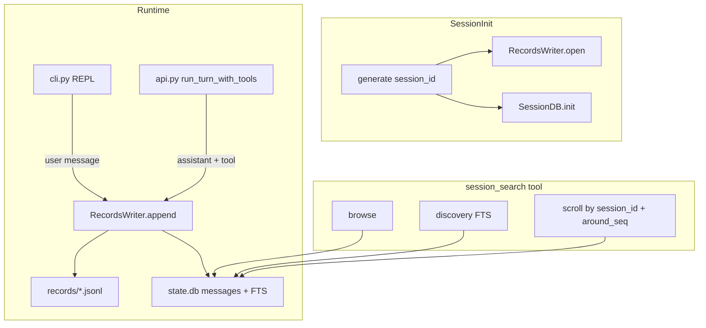

# miniclaw Session Records + session_search 实现计划

## 设计决策（已确认）

| 决策 | 选择 |
|------|------|
| 代码位置 | 独立包 [`miniclaw/sessions/`](miniclaw/sessions/)，与 [`miniclaw/memory/`](miniclaw/memory/) 分离 |
| 存储 | JSONL（source of truth）+ SQLite FTS5（查询面），路径 `~/.miniclaw/records/` + `~/.miniclaw/state.db` |
| 工具名 | `session_search` |
| 配置 | 独立 `sessions.enabled`，与 `memory.enabled` 解耦 |
| 当前 session | 初版 **默认排除**（browse/discovery 过滤 `current_session_id`） |
| FTS 范围 | 仅索引 `user` + `assistant` 的 `content`；`tool` 消息全量存储但不参与搜索 |
| 模型可见 ID | 仅 `session_id` + `seq`（见下节） |

### message_id vs seq（澄清）

二者**不相等**，但初版**只向模型暴露 seq**：

| 字段 | 作用域 | 用途 |
|------|--------|------|
| `seq` | session 内 1, 2, 3… | JSONL 对账、`session_search` scroll 锚点（`around_seq`） |
| `id`（DB 内部） | 全局 AUTOINCREMENT | FTS5 `rowid`、JOIN 查询；**不暴露给模型** |

每个 session 都有自己的 `seq=1`，因此不能用 seq 单独定位消息；scroll API 必须同时传 `session_id` + `around_seq`。这与 Hermes 用全局 `message_id` 等价，只是命名更贴近 JSONL。

---

## 架构



---

## 模块结构

新建 [`miniclaw/sessions/`](miniclaw/sessions/)：

```
miniclaw/sessions/
  __init__.py
  config.py       # SessionsConfig: enabled, records_max_event_bytes, search limits
  paths.py        # get_records_dir(), get_state_db_path()
  db.py           # SessionDB: schema init, FTS triggers, browse/search/scroll queries
  records.py      # RecordsWriter: dual-write, seq counter, content cap
  search.py       # session_search schema + handler (browse/discovery/scroll)
  anchored.py     # get_anchored_view: window + bookends (参考 Hermes)
```

**不放入 `memory/`**：memory 管语义笔记（MEMORY.md）；sessions 管情景 log + 检索，职责清晰。

---

## 数据模型

### sessions 表

```sql
CREATE TABLE sessions (
  id TEXT PRIMARY KEY,        -- session_id, e.g. a3f8b2c1
  started_at TEXT NOT NULL,
  ended_at TEXT,
  workspace TEXT,
  model TEXT,
  jsonl_path TEXT NOT NULL
);
```

### messages 表

```sql
CREATE TABLE messages (
  id INTEGER PRIMARY KEY AUTOINCREMENT,  -- 内部 FTS rowid，不暴露
  session_id TEXT NOT NULL REFERENCES sessions(id),
  seq INTEGER NOT NULL,
  ts TEXT NOT NULL,
  role TEXT NOT NULL,           -- user / assistant / tool / system
  content TEXT,
  tool_name TEXT,
  tool_call_id TEXT,
  tool_calls TEXT,
  type TEXT,                    -- NULL=消息; session_start / session_clear / context_compact
  UNIQUE(session_id, seq)
);
```

### FTS5（external content）

```sql
CREATE VIRTUAL TABLE messages_fts USING fts5(
  content,
  content='messages',
  content_rowid='id'
);
-- AFTER INSERT/DELETE/UPDATE triggers: 仅当 role IN ('user','assistant') 时同步
```

初版 CJK：先用默认 unicode61 + 对短中文 query 的 `LIKE` fallback（与 Hermes 思路一致，trigram 表留 Phase 2c）。

### JSONL 行格式

与 DB 对齐，每条带 `session_id` + `seq`：

```jsonl
{"ts":"...","session_id":"a3f8b2c1","seq":1,"type":"session_start","workspace":"...","model":"..."}
{"ts":"...","session_id":"a3f8b2c1","seq":2,"role":"user","content":"..."}
{"ts":"...","session_id":"a3f8b2c1","seq":3,"role":"assistant","content":"...","tool_calls":[...]}
{"ts":"...","session_id":"a3f8b2c1","seq":4,"role":"tool","name":"grep","content":"..."}
```

`content` 超 `records_max_event_bytes`（默认 100KB）时截断并附 `truncated: true, original_bytes: N`。

---

## session_search 工具

### 三种 shape（参数推断，无 mode 枚举）

判别顺序（参考 Hermes [`tools/session_search_tool.py`](../../hermes-agent/tools/session_search_tool.py)）：

1. `session_id` + `around_seq` → **scroll**
2. `query` 非空 → **discovery**
3. 否则 → **browse**

### 参数

| 参数 | 用途 |
|------|------|
| `query` | discovery 全文搜索 |
| `limit` | discovery 命中 session 数，默认 3，clamp 1–10 |
| `sort` | `newest` / `oldest`（discovery 排序） |
| `session_id` | scroll 目标 session |
| `around_seq` | scroll 锚点（session 内 seq） |
| `window` | scroll 窗口半径，默认 5，clamp 1–20 |

Runtime 注入（模型不可见）：`db`（SessionDB）、`current_session_id`（来自 context）。

### 行为要点

- **browse**：最近 N 个 session（排除 `current_session_id`），含 `started_at`、`workspace`、首条 user 预览（80 字）、消息数
- **discovery**：FTS 搜索 → 排除当前 session → 每条命中返回 snippet + ±window 消息 + bookend_start/end（各 3 条 user/assistant）
- **scroll**：`get_messages_around(session_id, around_seq, window)`；window 可含相邻 tool 消息以还原现场；若 anchor 落在当前 session → 拒绝（与 Hermes lineage guard 类似，初版简化版）

### 与 memory 的边界（写入 schema description）

- `memory`：跨 session 精炼事实
- `session_search`：查历史对话原文；不要把整段对话写入 MEMORY.md

---

## 接入点

### 1. [`miniclaw/cli.py`](miniclaw/cli.py) `_init_session`

- 若 `sessions.enabled`：生成 `session_id`，创建 `RecordsWriter` + `SessionDB`，写入 `session_start`
- `context["session_id"]` = session_id
- `context["records_writer"]` = writer
- `context["session_db"]` = db
- `get_tool_schemas(include_memory=..., include_session_search=...)`

### 2. [`miniclaw/cli.py`](miniclaw/cli.py) `_repl_loop`

- 每条 user 输入（含 `/plan` 注入的 user 消息）→ `writer.append_user()`
- `/clear` → `writer.append_meta("session_clear")`，不换 session_id / 不换 JSONL 文件
- `/quit` → `writer.append_meta("session_end")` + `sessions.ended_at` 更新

### 3. [`miniclaw/api.py`](miniclaw/api.py) `run_turn_with_tools`

- 每轮 `messages.append(assistant_msg)` 后 → `writer.append_assistant(message)`
- 每个 tool result append 后 → `writer.append_tool(...)`

### 4. [`miniclaw/context/manage.py`](miniclaw/context/manage.py)

- `summarize_conversation` 成功后 → `writer.append_meta("context_compact", summary=..., messages_before=..., messages_after=...)`

### 5. [`miniclaw/tools.py`](miniclaw/tools.py)

- 注册 `session_search` handler（从 context 取 `session_db` + `current_session_id`）
- `get_tool_schemas(include_session_search=True)` 条件暴露
- `_print_tool_invocation` 增加 session_search 摘要行

### 6. [`miniclaw/settings.py`](miniclaw/settings.py) + [`miniclaw/default_config.json`](miniclaw/default_config.json)

```json
"sessions": {
  "enabled": false,
  "records_max_event_bytes": 100000,
  "search_default_limit": 3,
  "search_window": 5
}
```

新增 `get_sessions_config(workspace)` → `SessionsConfig`。

### 7. [`miniclaw/skills.py`](miniclaw/skills.py) `build_system_prompt`

- 可选：当 sessions 启用时，在 system prompt 加一行简短说明（`session_search` 可查历史；`memory` 管长期笔记）。保持极简，1–2 句。

---

## 测试

新建 [`tests/test_sessions_records.py`](tests/test_sessions_records.py)、[`tests/test_session_search.py`](tests/test_session_search.py)：

- disabled 时不写文件、tool 不可用
- dual-write：JSONL 行 seq 与 DB `messages.seq` 一致
- content cap + `truncated` 标记
- FTS discovery 命中 / 不命中
- browse 排除 current session
- scroll `session_id` + `around_seq` 窗口正确
- bookends 在 discovery 响应中存在
- path 隔离：temp dir monkeypatch `get_user_data_dir`

---

## 文档

更新 [`docs/design/agent-memory.md`](docs/design/agent-memory.md)：

- Phase 2a：sessions 包 + records 双写
- Phase 2b：`session_search` 工具
- 明确与 memory 的分工、`session_id`/`seq` 语义、FTS 范围
- 注明「当前 session 搜索」为后续优化项

---

## 实现顺序

1. `sessions/config.py` + `paths.py` + `settings` + `default_config.json`
2. `sessions/db.py` schema + FTS triggers + 基础查询
3. `sessions/records.py` dual-write + 单元测试
4. `cli.py` / `api.py` 写入 hook
5. `sessions/anchored.py` + `sessions/search.py` + tool 注册
6. `context/manage.py` compact 事件
7. 集成测试 + design doc 更新

**本 PR 不做**：`/reflect`、CJK trigram 表、搜索当前 session、read 整 session dump shape。
